# tq (TransferQueue) vs. td (TransferDaemon) 存储架构分析

本文档基于代码库分析，对 `tq` (simplestorage) 和 `td` (基于 segment 的存储) 进行了深入的对比分析。

## 1. 架构与时序图

### 1.1 tq simplestorage 架构

**概述**: `tq` 使用简单的对象存储模型。Manager 通过对全局索引 (Global Index) 进行取模哈希 (Mod-Sharding) 将数据分散到多个 `SimpleStorageUnit` 进程中。底层存储使用 Python 字典和列表实现。

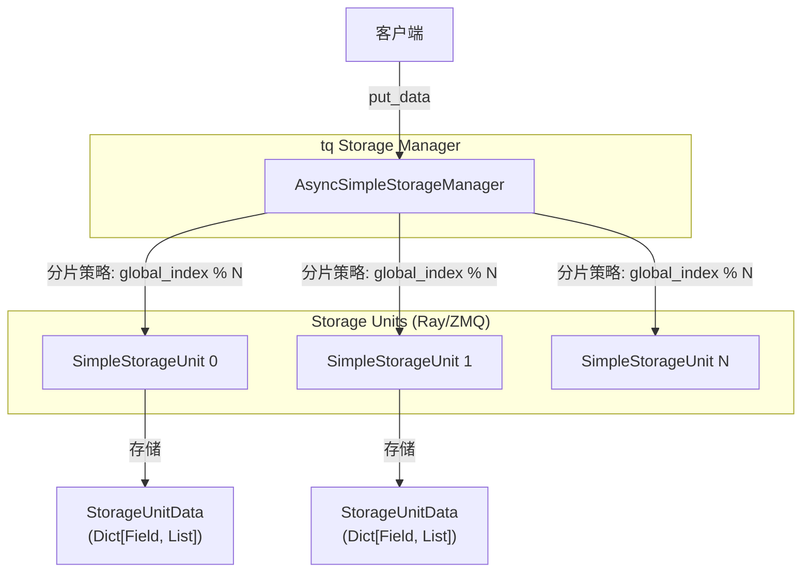

### 1.2 td Segment Storage 架构

**概述**: `td` 采用了更复杂的 Manager-Shard 架构。Manager 动态分配“组 (Groups)”（连续的索引块）给 Shard 以确保负载均衡。Shard 使用 `ExperienceTable`，其底层由 `MemorySegment` (零拷贝 ZMQ Frame) 支持，以实现高性能存储。

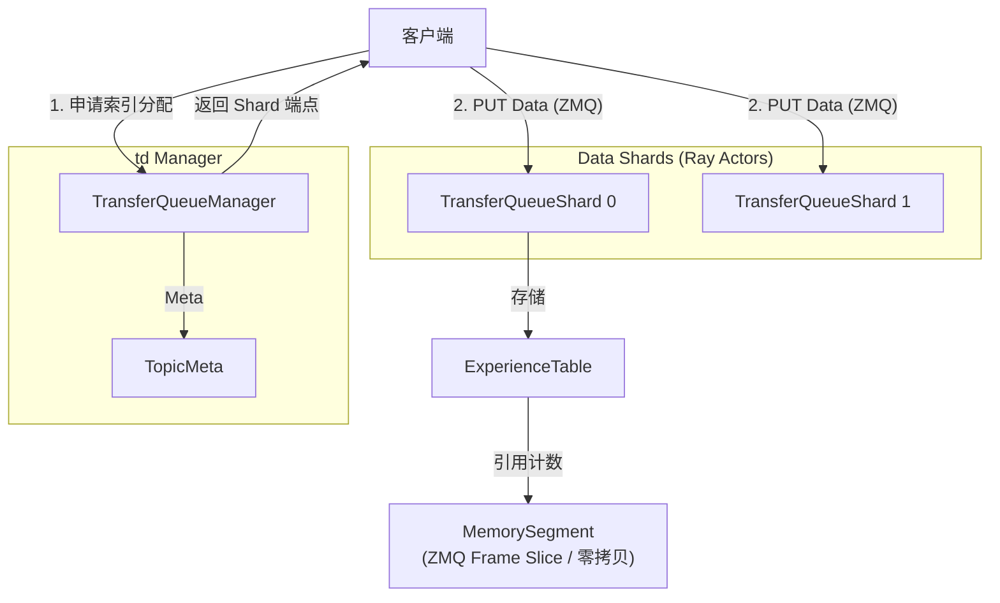

### 1.3 核心流程时序图

#### tq 写入流程 (Put Data)
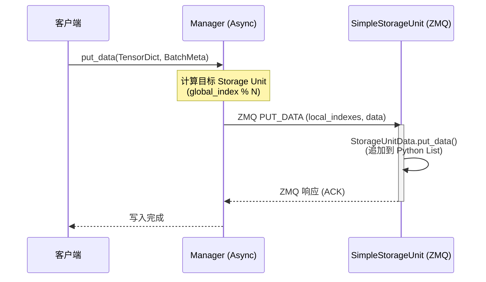

#### td 写入流程 (Put Data)
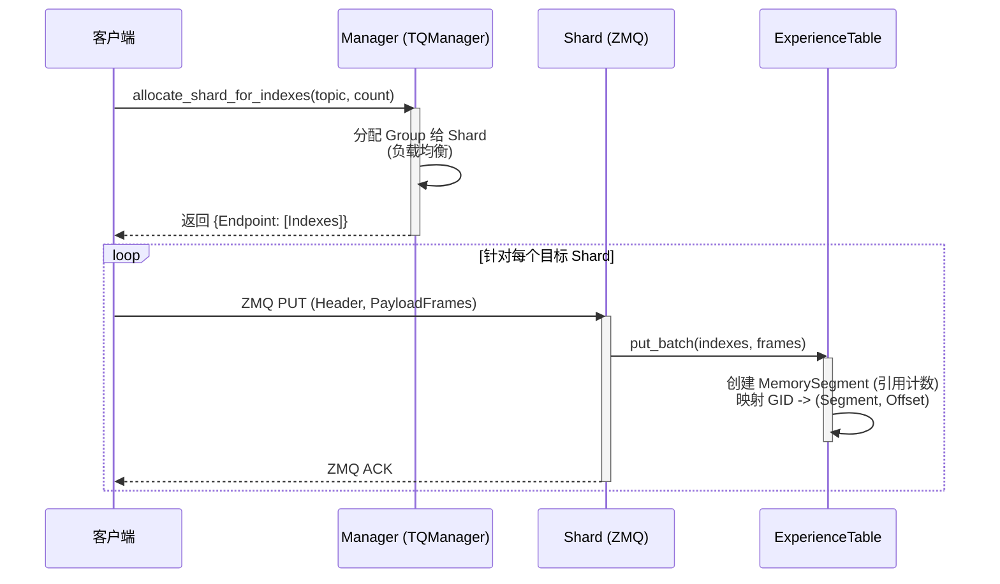

## 2. 深度对比分析：Partition (tq) vs. Segment (td)

在实测中 `td` (Segment) 的性能显著优于 `tq` (Partition/Simplestorage)。以下通过图表形式详细分析其架构优势。

### 2.1 存储机制对比

| 特性 | tq (`simplestorage`) | td (`segment`) |
| :--- | :--- | :--- |
| **分片键** | `global_index % num_units` (静态哈希) | 动态 Group 分配 (块状分配) |
| **物理存储** | `dict[field_name, list[object]]` | `MemorySegment` (包装原始字节的 ZMQ Frame) |
| **内存模型** | 高开销 (每个样本一个 Python 对象) | **零拷贝** / Slab 分配 (基于 Batch) |
| **并发模型** | 每个 Unit 单线程 (受 GIL 限制) | Asyncio 事件循环 + Ray Actors |
| **序列化** | Pickle / Torch 序列化 (通用但慢) | 原始字节流 / Numpy Buffer 协议 |

### 2.2 内存布局与开销对比 (关键优势)

**分析**: `tq` 存储的是离散的 Python 对象列表，导致巨大的内存碎片和指针开销。而 `td` 保持了数据的 Batch 结构，以连续内存块 (Blob) 形式存储，通过切片引用，实现极致的内存效率和 CPU 缓存友好性。

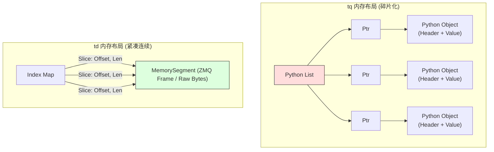

### 2.3 数据访问模式对比 (架构优势)

**分析**:
*   **tq (Scatter-Gather)**: 当读取一个连续的 Batch 时，由于 Module N 的分片方式，请求被“打散”到所有节点。这导致了严重的 **Incast (扇入)** 问题，网络吞吐受限于最慢的节点，且建立连接开销大。
*   **td (Locality)**: 由于采用 Group (块) 分配，连续索引通常位于同一个 Shard。客户端可以保持长连接，批量流式传输数据，极大减少了网络交互次数。

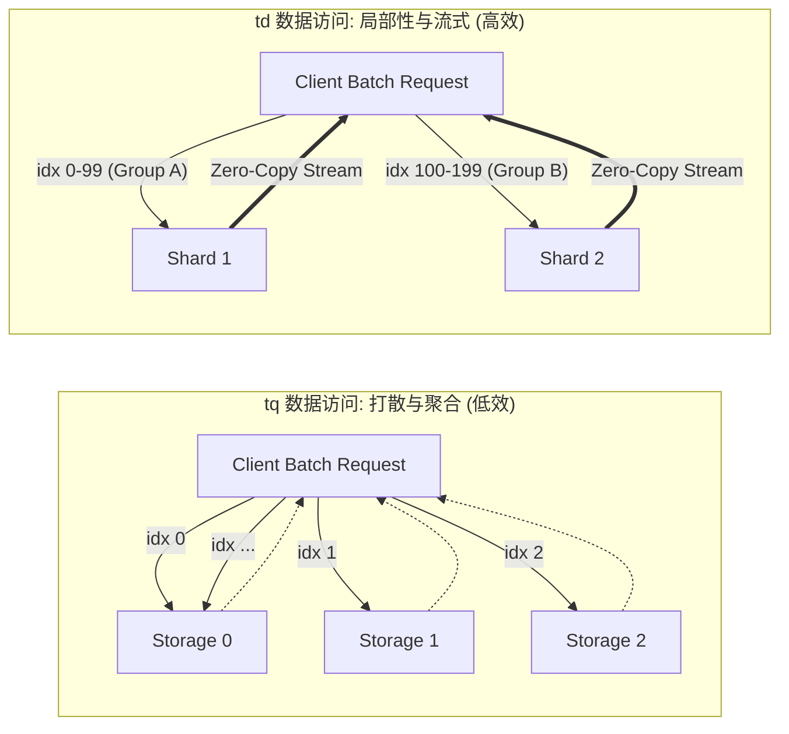

### 2.4 可维护性与代码可读性

*   **tq**: 代码更简单、更符合 Python 习惯（使用标准类）。适合初学者阅读，但隐藏了性能陷阱（如 GIL、序列化成本）。扩展特定功能（如版本控制、过期淘汰）时，往往需要修改核心数据结构，导致耦合度高。
*   **td**: 代码复杂度较高。它显式管理内存（`MemorySegment` 中的引用计数），操作原始字节缓冲区，并手动处理 ZMQ 帧。
    *   **代价**: `td` 更难维护（如果错过 `release()` 调用可能导致内存泄漏），代码可读性较差。
    *   **收益**: 这种复杂性是为了获得高性能（在 Python 中模拟 C++ 风格的内存管理）所必须的。且其元数据（ExperienceTable）与载荷（MemorySegment）分离的设计，使得扩展新功能（如按版本清理、按 Tag 索引）时更灵活，不侵入数据存储层。

### 总结

`td` 方案通过 **零拷贝 (Zero-Copy)** 内存管理和 **保留局部性 (Locality-preserving)** 的分片策略，解决了 `tq` 在大规模数据吞吐下的序列化和网络瓶颈。尽管牺牲了一定的代码简洁性，但换取了数量级的性能提升。

---

## 3. 深度劣势分析：`tq` Partition 方案

本节进一步细化分析 `tq` 基于 `partition_id` 和静态哈希分片方案的额外劣势。

### 3.1 静态哈希分片的固有缺陷

#### 3.1.1 无法感知数据热度

**问题**: `global_index % N` 的分片方式对数据的访问模式是完全"盲"的。

```python
# simple_backend_manager.py L100-103
self.global_index_storage_unit_mapping = lambda x: list(self.storage_unit_infos.keys())[
    x % len(self.storage_unit_infos)
]
```

*   **无法处理热点 (Hot Spot)**: 如果某些 `global_index` 范围的数据被频繁读取（例如，最近生成的训练数据），这些热点数据仍然均匀分布在所有 Storage Unit 上，无法将热点数据聚合到更少的节点以利用缓存或减少网络跳数。
*   **无法实现数据分层 (Tiering)**: 无法根据访问频率将数据自动迁移到更快或更慢的存储层。`td` 的 Group 分配机制可以结合 Manager 元数据轻松实现这类策略。

#### 3.1.2 Partition 与 Storage Unit 的解耦失败

虽然 `partition_id` 意图提供逻辑隔离，但当前实现中：

*   **`partition_id` 仅为标签**: `partition_id` 只存储在 `SampleMeta` 元数据中，并不影响实际的物理存储位置（由 `global_index % N` 决定）。这意味着同一 `partition_id` 的数据仍可能分散在所有 Storage Unit 中。
*   **无法实现真正的租户隔离**: 不同 `partition_id` 的数据在物理上混合存储，无法提供资源隔离（CPU、内存、网络带宽）、故障隔离或独立的 QoS 保障。

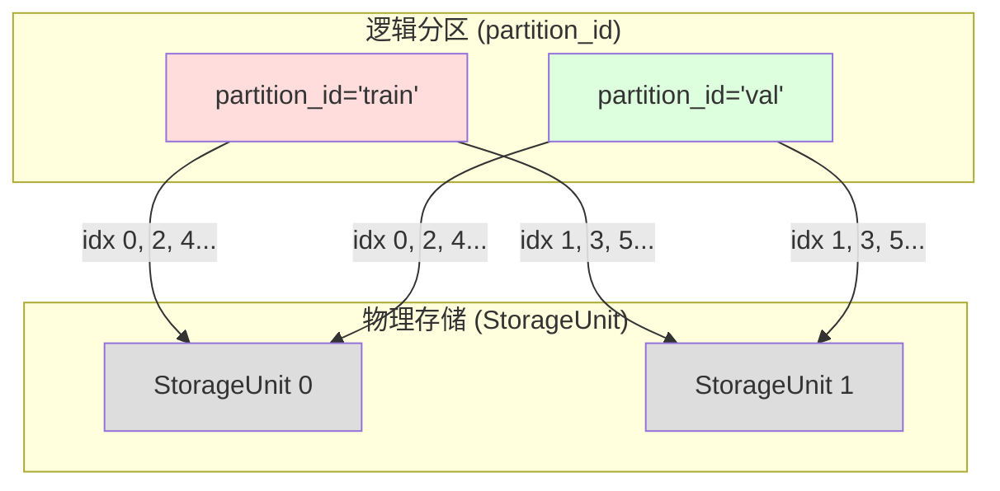
> `partition_id` 只是一个逻辑标签，无法改变数据在 StorageUnit 间的物理分布。

---

### 3.2 运维与可观测性问题

#### 3.2.1 容量规划困难

*   **静态分片数**: `N` (Storage Unit 数量) 在启动时确定。若负载变化需要调整 `N`，则所有现有数据的 `local_index` 映射都会失效，必须进行全量数据迁移。
*   **无法在线扩容/缩容**: 增加或减少 Storage Unit 需要停服重新分配数据。`td` 的 Group 动态分配机制天然支持在线扩缩容。

#### 3.2.2 负载倾斜难以检测和修复

*   **隐式倾斜**: 由于使用取模哈希，如果写入的 `global_index` 不是均匀分布的（例如，存在跳跃或某些范围被跳过），就会导致 Storage Unit 之间数据量不均。
*   **无监控指标**: 当前实现缺乏对每个 Storage Unit 的负载（请求数、数据量、延迟）的主动暴露，运维难以定位性能瓶颈。

---

### 3.3 内存与 GC 压力

#### 3.3.1 Python 对象开销

`StorageUnitData` 使用 `dict[str, list[object]]` 存储数据：

```python
# simple_backend.py L67-70
self.field_data: dict[str, list] = {}
self.storage_size = storage_size

# L114
self.field_data[f] = [None] * self.storage_size  # 预分配一个巨大的 Python List
```

*   **对象头开销**: 每个 Python 对象有约 56+ bytes 的头部开销。对于 1M 个样本，仅指针数组就需要 ~8MB，加上对象头部开销将达到 ~50MB+。
*   **GC 扫描成本**: Python 的 GC 需要遍历所有对象来确定可达性。大量离散对象显著增加 GC 的 STW (Stop-The-World) 时间，导致服务抖动。

#### 3.3.2 内存碎片化

*   每次 `put_data` 时替换 List 中的元素，会创建新 Python 对象，旧对象等待 GC 回收。
*   这种高频的内存分配/回收模式极易导致内存碎片化，使得实际可用内存远低于物理内存。

**对比**: `td` 使用 `MemorySegment` 包装 `zmq.Frame`，后者是 libzmq 在 C++ 层管理的连续内存块，Python GC 只需要扫描远少于样本数的引用计数元对象。

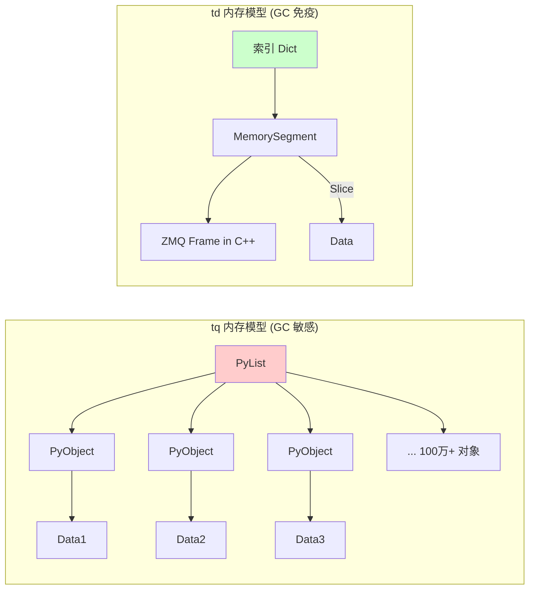

---

### 3.4 序列化瓶颈

#### 3.4.1 全量序列化

`_handle_put` 和 `_handle_get` 中，数据通过 `ZMQMessage` 序列化传输：

```python
# simple_backend_manager.py L246-247
data = request_msg.serialize()
await socket.send_multipart(data, copy=False)
```

*   `ZMQMessage.serialize()` 内部通常使用 `pickle` 或 `msgpack`，对 Python 对象进行完整的序列化。
*   对于 Tensor 数据，这意味着：`Tensor (CPU/GPU) -> bytes (内存复制) -> ZMQ Socket -> 网络 -> ZMQ Socket -> bytes -> Tensor (反序列化)`。
*   **中小型数据特别慢**: 对于元素数量少但 Batch 次数多的场景，序列化/反序列化开销远大于数据传输本身。

**对比**: `td` 使用 `payload_frames: List[zmq.Frame]` 直接传递原始字节，无需 Python 层序列化。

---

### 3.5 并发与扩展性瓶颈

#### 3.5.1 单线程事件循环

`SimpleStorageUnit` 在一个守护线程中运行 ZMQ 轮询循环：

```python
# simple_backend.py L206-209
self.process_put_get_thread = Thread(
    target=self._process_put_get, name=..., daemon=True
)
```

*   每个 Storage Unit 只有一个处理线程，所有请求串行处理。
*   **GIL 限制**: 即使想通过多线程提升并发，Python GIL 也会阻碍 CPU 密集型的序列化/处理操作并行。

#### 3.5.2 连接数爆炸

*   `AsyncSimpleStorageManager` 在 `dynamic_storage_manager_socket` 中，每次请求都新建 ZMQ Context 和 Socket。
*   在高并发场景下，频繁的 `connect()` / `close()` 导致 TCP TIME_WAIT 堆积、文件描述符耗尽风险。

```python
# simple_backend_manager.py L137-140
context = zmq.asyncio.Context()
...
sock = create_zmq_socket(context, zmq.DEALER, identity=identity)
sock.connect(address)
```

---

### 3.6 故障隔离与恢复能力弱

#### 3.6.1 无检查点 (Checkpoint) 能力

*   数据存储在内存中的 Python `dict` 和 `list`，一旦进程崩溃，数据全部丢失。
*   无持久化层，无法实现快速恢复。

#### 3.6.2 扇入故障放大

由于读取一个 Batch 需要访问所有 Storage Unit（Scatter-Gather 模式），任意一个 Storage Unit 的故障或超时都会导致整个读取操作失败。

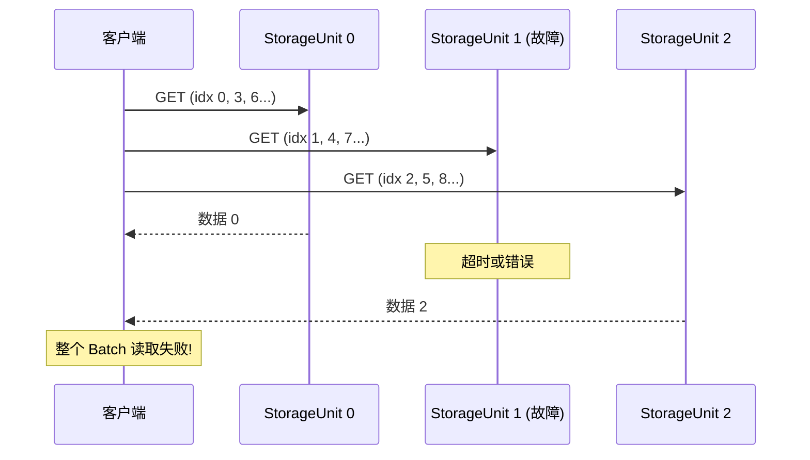

---

### 3.7 劣势总结表

| 劣势类别 | 具体问题 | 影响 | td 方案如何解决 |
| :--- | :--- | :--- | :--- |
| **分片策略** | 静态取模哈希，无法感知热点/负载 | 热点不聚合，扩容需停服 | 动态 Group 分配，支持在线扩缩容 |
| **逻辑隔离** | `partition_id` 仅为标签，无物理隔离 | 无法提供租户级 QoS | Group 粒度可绑定到特定 Shard |
| **内存效率** | 每样本一个 Python 对象，高 GC 压力 | 内存碎片化，服务抖动 | C++ 层内存管理 + 零拷贝 Slice |
| **序列化** | Python 序列化 (Pickle/Msgpack) | 高 CPU 消耗，带宽浪费 | 原始字节 `zmq.Frame` 直接传递 |
| **并发** | 单线程处理 + GIL，短连接模式 | 吞吐量天花板低 | Asyncio 事件循环 + 连接复用 |
| **可靠性** | 无检查点，Scatter-Gather 扇入故障放大 | 单点故障导致全局失败 | 局部性保证，故障影响范围小 |

---

## 4. 用户使用视角对比

本节从用户（开发者）使用角度对比 `tq` 和 `td` 两种方案在 API 设计、学习曲线、调试体验和典型工作流上的差异。

### 4.1 API 设计对比

#### 4.1.1 数据模型抽象

| 方面 | tq (Partition 模式) | td (Topic/Experience 模式) |
| :--- | :--- | :--- |
| **核心抽象** | `partition_id` + `TensorDict` | `topic` + `experience_columns` |
| **数据组织** | 以"分区"为单位，类似传统数据库 | 以"主题"为单位，类似消息队列 |
| **语义** | 存储导向（我把数据放哪） | 业务导向（这批数据属于哪个训练阶段） |
| **灵活性** | 分区之间独立，需手动管理 | 内置 consumer 追踪、版本控制 |

**tq 的 partition_id 模式**:
```python
# tq: 用户需要自己管理 partition_id
client.put(data=tensor_dict, partition_id="train_step_100")
batch_meta = client.get_meta(data_fields=["input_ids"], batch_size=4, partition_id="train_step_100")
data = client.get_data(batch_meta)
client.clear_partition(partition_id="train_step_100")
```

**td 的 topic/experience 模式**:
```python
# td: 内置 consumer 追踪和采样策略
client.add_topic(prompts_num=1000, n_samples_per_prompt=4, 
                 experience_columns=["prompts", "rewards"], 
                 experience_consumers=["trainer", "critic"])
client.put_experience(data_dict, indexes=[0, 1, 2])
data, indexes = client.get_experience(
    consumer="trainer", 
    experience_columns=["prompts"], 
    experience_count=32,
    sampler_func=RandomSampler  # 内置采样器
)
```

#### 4.1.2 API 易用性对比

| 功能 | tq | td |
| :--- | :--- | :--- |
| **写入** | `client.put(data, partition_id)` | `client.put_experience(data_dict, indexes)` |
| **读取** | 需先 `get_meta` 再 `get_data` (两次调用) | `get_experience` 一次调用返回数据和索引 |
| **清理** | `clear_partition` / `clear_samples` | `clear_topic` / `prune_topic_by_indexes` |
| **消费追踪** | ❌ 需用户手动实现 | ✅ 内置 consumer 追踪 |
| **采样策略** | ❌ 无 | ✅ 内置 `RandomSampler`, `VersionSampler`, `SeqLenBalSampler` |
| **版本控制** | ❌ 无 | ✅ `record_versions`, `clear_data_by_version` |
| **Metrics 集成** | ❌ 无 | ✅ 内置 `get_metrics`, `update_metrics`, 计时统计 |

---

### 4.2 学习曲线与上手难度

#### tq 方案

**优点**:
- 概念简单：只需理解 `partition_id` + `TensorDict`
- 接口直观：类似于 KV Store 的 put/get 语义
- 文档和教程友好（见 `tutorial/01_core_components.py`）

**缺点**:
- 需要手动管理 `partition_id` 生命周期
- 元数据和数据分离 (`get_meta` + `get_data`)，增加理解成本
- 无内置消费追踪，用户需自行实现重复消费防护

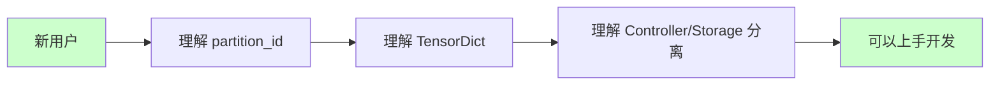

#### td 方案

**优点**:
- 语义丰富：`topic`, `consumer`, `experience`, `version` 等概念贴近 RL 训练场景
- 内置高级功能：采样器、指标、版本控制等开箱即用
- 零拷贝控制暴露给用户 (`copy=False/True`)

**缺点**:
- 概念较多，初次接触需要理解 `topic`, `n_samples_per_prompt`, `experience_columns`, `consumers` 等
- API 参数复杂，`get_experience` 有 10+ 个可选参数

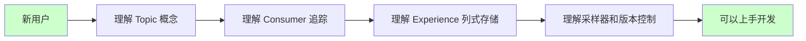

---

### 4.3 典型工作流对比

#### 4.3.1 RLHF 训练数据流

**tq 方案的典型流程**:

```mermaid
sequenceDiagram
    participant Actor
    participant TQ as TQ-tq
    participant Trainer
    
    Actor->>TQ: put prompts
    Actor->>TQ: put rewards
    Note over Actor,TQ: 用户需自行等待两次 put 完成
    
    Trainer->>TQ: get_meta
    Trainer->>TQ: get_data
    Note over Trainer: 需两次调用
    
    Trainer->>TQ: clear_partition
    Note over Trainer: 用户需手动清理
```

**td 方案的典型流程**:

```mermaid
sequenceDiagram
    participant Actor
    participant TD as TD-td
    participant Trainer
    
    Actor->>TD: put_padded_prompts_experience
    Actor->>TD: put_experience
    
    Trainer->>TD: get_experience
    Note over TD: 自动追踪消费进度
    
    Trainer->>TD: prune_topic_by_indexes
    Note over TD: 按需清理 + 版本追踪
```

#### 4.3.2 多 Consumer 场景

**tq 方案**: 无内置支持，用户需自行实现消费追踪。

```python
# tq: 用户需自己维护消费状态
consumed_indexes = set()
while not all_consumed:
    batch_meta = client.get_meta(...)
    data = client.get_data(batch_meta)
    consumed_indexes.update(batch_meta.global_indexes)
    # 用户自行检查是否全部消费完毕
```

**td 方案**: 内置 consumer 注册和追踪。

```python
# td: 内置消费追踪
client.add_topic(..., experience_consumers=["trainer", "critic", "reward_model"])

# 各 consumer 独立读取，互不干扰
trainer_data = client.get_experience(consumer="trainer", experience_count=32)
critic_data = client.get_experience(consumer="critic", experience_count=32)

# 检查消费状态
client.all_consumed(consumer="trainer")  # True/False
```

---

### 4.4 调试与问题排查体验

| 方面 | tq | td |
| :--- | :--- | :--- |
| **日志输出** | 基本的 logger，无结构化指标 | 结构化日志，内置延迟/吞吐量统计 |
| **错误信息** | 通用异常，需深入代码排查 | 详细错误上下文（节点、索引、列名） |
| **状态可观测** | 需通过 Controller 手动查询 | `get_metrics`, `get_timings` 内置 API |
| **问题定位** | 分布式追踪困难 | Endpoint 级别的延迟报告 |

**td 的内置监控能力**:
```python
# td 内置的监控 API
client.get_timings()  # {'put': 1.23, 'get': 0.45, 'put_prompt': 2.10}
client.get_metrics(topic="Trainer")  # 业务指标

# 日志输出示例
# [TransferQueue Put] Topic: Trainer | Total Items: 128 | Total Latency: 12.34 ms | Total Volume: 5.67 MB
# [TransferQueue Get] Topic: Trainer | Items: 32 | Latency: 8.90 ms | Shards: 4
```

---

### 4.5 用户使用视角总结

| 维度 | tq (Partition 模式) | td (Topic/Experience 模式) |
| :--- | :--- | :--- |
| **适合场景** | 通用数据存储、简单 KV 语义 | RLHF/RL 训练场景 |
| **学习曲线** | ⭐⭐ 平缓 | ⭐⭐⭐⭐ 较陡峭 |
| **开发效率** | 基础功能快速上手，高级功能需自建 | 高级功能开箱即用 |
| **调试友好度** | ⭐⭐ | ⭐⭐⭐⭐ |
| **生产就绪度** | ⭐⭐⭐ (需大量额外开发) | ⭐⭐⭐⭐⭐ (功能完备) |

> **选型建议**:
> - 如果你的场景是**通用数据传输**，且团队更熟悉传统 KV 存储语义，`tq` 方案入门更快。
> - 如果你的场景是**大规模 RLHF 训练**，需要消费追踪、版本控制、采样策略等功能，`td` 方案的生产力优势明显。
