# TD vs TQ 数据流分析对比

本文档分析 TD (TensorDock) 和 TQ (TransferQueue) 的 `put_data` 和 `get_data` 流程，对比两者架构设计，体现 TD 在性能和架构设计上的优越性。

---

## 1. 系统架构概览

### 1.1 TQ 系统架构

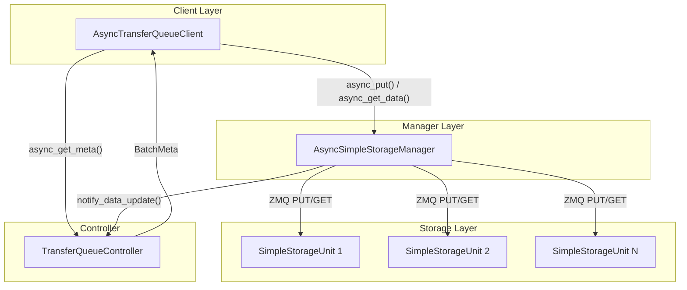
```mermaid
graph TB
    subgraph Client Layer
        A[AsyncTransferQueueClient]
    end
    
    subgraph Manager Layer
        B[AsyncSimpleStorageManager]
    end
    
    subgraph Storage Layer
        C1[SimpleStorageUnit 1]
        C2[SimpleStorageUnit 2]
        C3[SimpleStorageUnit N]
    end
    
    subgraph Controller
        D[TransferQueueController]
    end
    
    A -->|"async_get_meta()"| D
    D -->|"BatchMeta"| A
    A -->|"async_put() / async_get_data()"| B
    B -->|"ZMQ PUT/GET"| C1
    B -->|"ZMQ PUT/GET"| C2
    B -->|"ZMQ PUT/GET"| C3
    B -->|"notify_data_update()"| D
```

### 1.2 TD 系统架构

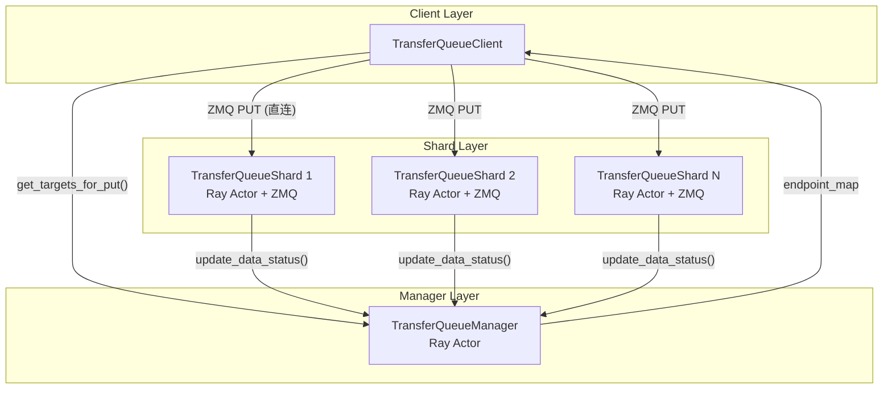
```mermaid
graph TB
    subgraph Client Layer
        A[TransferQueueClient]
    end
    
    subgraph Manager Layer
        B[TransferQueueManager<br/>Ray Actor]
    end
    
    subgraph Shard Layer
        C1[TransferQueueShard 1<br/>Ray Actor + ZMQ]
        C2[TransferQueueShard 2<br/>Ray Actor + ZMQ]
        C3[TransferQueueShard N<br/>Ray Actor + ZMQ]
    end
    
    A -->|"get_targets_for_put()"| B
    B -->|"endpoint_map"| A
    A -->|"ZMQ PUT (直连)"| C1
    A -->|"ZMQ PUT"| C2
    A -->|"ZMQ PUT"| C3
    C1 -->|"update_data_status()"| B
    C2 -->|"update_data_status()"| B
    C3 -->|"update_data_status()"| B
```

### 1.3 架构对比总表

| 特性 | TD | TQ |
|-----|----|----|
| 存储单元 | `ExperienceTable` (列式存储) | `StorageUnitData` (行式存储) |
| 数据分发 | Client 直连 Shard | Client → Manager → StorageUnit |
| 元数据管理 | Manager 内存映射 | Controller 持久化 |
| 通信协议 | 轻量 bytes 协议 | 完整 ZMQMessage 协议 |
| 零拷贝 | `zmq.Frame` + `MemorySegment` | `memoryview` + `torch.frombuffer` |

---

## 2. 核心数据结构对比

### 2.1 TQ 类图

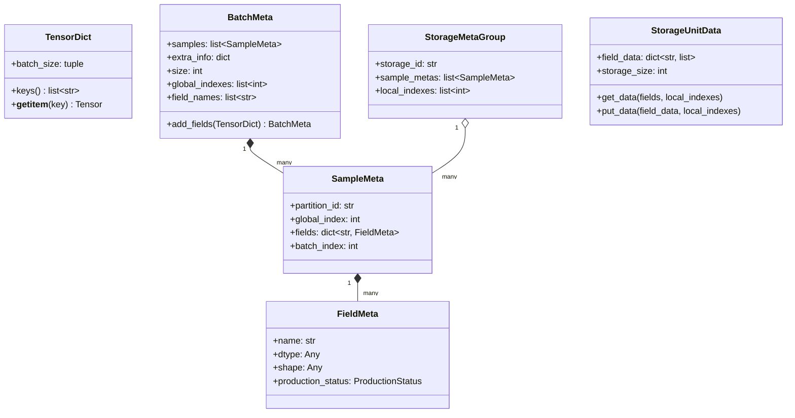
```mermaid
classDiagram
    class TensorDict {
        +batch_size: tuple
        +keys() list~str~
        +__getitem__(key) Tensor
    }
    
    class BatchMeta {
        +samples: list~SampleMeta~
        +extra_info: dict
        +size: int
        +global_indexes: list~int~
        +field_names: list~str~
        +add_fields(TensorDict) BatchMeta
    }
    
    class SampleMeta {
        +partition_id: str
        +global_index: int
        +fields: dict~str, FieldMeta~
        +batch_index: int
    }
    
    class FieldMeta {
        +name: str
        +dtype: Any
        +shape: Any
        +production_status: ProductionStatus
    }
    
    class StorageMetaGroup {
        +storage_id: str
        +sample_metas: list~SampleMeta~
        +local_indexes: list~int~
    }
    
    class StorageUnitData {
        +field_data: dict~str, list~
        +storage_size: int
        +get_data(fields, local_indexes)
        +put_data(field_data, local_indexes)
    }
    
    BatchMeta "1" *-- "many" SampleMeta
    SampleMeta "1" *-- "many" FieldMeta
    StorageMetaGroup "1" o-- "many" SampleMeta
```

### 2.2 TD 类图

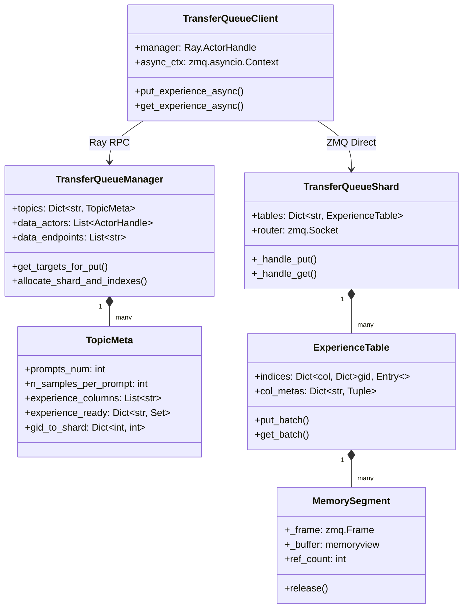
```mermaid
classDiagram
    class TransferQueueClient {
        +manager: Ray.ActorHandle
        +async_ctx: zmq.asyncio.Context
        +put_experience_async()
        +get_experience_async()
    }
    
    class TransferQueueManager {
        +topics: Dict~str, TopicMeta~
        +data_actors: List~ActorHandle~
        +data_endpoints: List~str~
        +get_targets_for_put()
        +allocate_shard_and_indexes()
    }
    
    class TopicMeta {
        +prompts_num: int
        +n_samples_per_prompt: int
        +experience_columns: List~str~
        +experience_ready: Dict~str, Set~
        +gid_to_shard: Dict~int, int~
    }
    
    class TransferQueueShard {
        +tables: Dict~str, ExperienceTable~
        +router: zmq.Socket
        +_handle_put()
        +_handle_get()
    }
    
    class ExperienceTable {
        +indices: Dict~col, Dict~gid, Entry~~
        +col_metas: Dict~str, Tuple~
        +put_batch()
        +get_batch()
    }
    
    class MemorySegment {
        +_frame: zmq.Frame
        +_buffer: memoryview
        +ref_count: int
        +release()
    }
    
    TransferQueueClient --> TransferQueueManager : Ray RPC
    TransferQueueClient --> TransferQueueShard : ZMQ Direct
    TransferQueueManager "1" *-- "many" TopicMeta
    TransferQueueShard "1" *-- "many" ExperienceTable
    ExperienceTable "1" *-- "many" MemorySegment
```

---

## 3. TQ 数据流分析

### 3.1 复杂度符号说明

| 符号 | 含义 | 典型值 |
|------|------|--------|
| **B** | Batch Size，单次请求的样本数 | 64 ~ 1024 |
| **F** | Fields，字段数量 | 2 ~ 10 |
| **T** | Total Elements，所有 Tensor 元素总数 | B × SeqLen × F |
| **S** | Storage Units / Shards 数量 | 1 ~ 8 |
| **N** | 单个 StorageUnit 分配的 indexes 数 | B / S |

> **说明**: 各 StorageUnit 的 N 相加等于 B，即 Σ(N_i) = B

### 3.2 端到端复杂度对比 (S=1 典型场景)

以单 StorageUnit/Shard 场景为基准，对比 TQ 和 TD 的完整开销：

#### PUT 操作复杂度

| 阶段 | TQ | TD | 差异 |
|------|----|----|------|
| 分组计算 | `build_storage_meta_groups()` O(B) | `get_targets_for_put()` O(N) 查表 | TD 预计算 |
| 数据过滤 | `_filter_storage_data()` O(B × F) | 直接切片 O(1) | TD 无过滤 |
| 序列化 | `_pack_data()` O(T) | `serialize_batch()` O(T) | 相当 |
| 网络传输 | O(T) | O(T) | 相当 |
| 反序列化 (存储端) | `_unpack_data()` O(T) | 直接使用 zmq.Frame O(1) | TD 零拷贝 |
| 存储写入 | `put_data()` O(B × F) | `put_batch()` O(B × F) | 相当 |
| dtype/shape 收集 | O(B × F) 双层循环 | 无 | TD 无此开销 |
| 状态通知 | `notify_data_update()` **O(B × F)** 阻塞 | `update_data_status()` 异步 | TD 异步 |
| 元数据更新 | `add_fields()` O(B × F) | 无 | TD 无此开销 |
| **PUT 总计** | **O(T) + O(B×F) × 5** | **O(T) + O(B×F)** | TD 减少 4 倍 |

> **重要**: `notify_data_update()` 不仅是网络调用！Controller 端 `update_production_status()` 内部包含 O(B×F) 循环处理：
> - `_update_field_metadata()`: 遍历 B 个 global_indexes，每个更新 F 个 fields
> - Tensor 索引赋值: `production_status[global_indices, field_indices] = 1`

#### GET 操作复杂度

| 阶段 | TQ | TD | 差异 |
|------|----|----|------|
| 分组计算 | `build_storage_meta_groups()` O(B) | `allocate_shard_and_indexes()` O(N) | 类似 |
| 存储端获取 | `get_data()` O(B × F) | `get_batch()` O(B × F) | 相当 |
| 序列化响应 | `_pack_data()` O(T) | `bytearray` 拼接 O(T) | 相当 |
| 网络传输 | O(T) | O(T) | 相当 |
| 反序列化 | `_unpack_data()` O(T) | `np.frombuffer()` O(1) | TD 零拷贝 |
| 结果合并 | 三层循环 O(B × F) | 单层遍历 O(B × F) | 相当 |
| 排序处理 | `ordered_data` O(B × F) | 直接使用 O(1) | TD 无排序 |
| 构建输出 | `TensorDict` + `torch.stack` O(B × F) | 返回 `List[Tensor]` O(1) | TD 无转换 |
| **GET 总计** | **O(T) + O(B×F) × 4** | **O(T) + O(B×F) × 2** | TD 减少一半 |

### 3.3 TQ 扩展性瓶颈分析

随着 StorageUnit 数量 S 增加，TQ 面临以下问题：

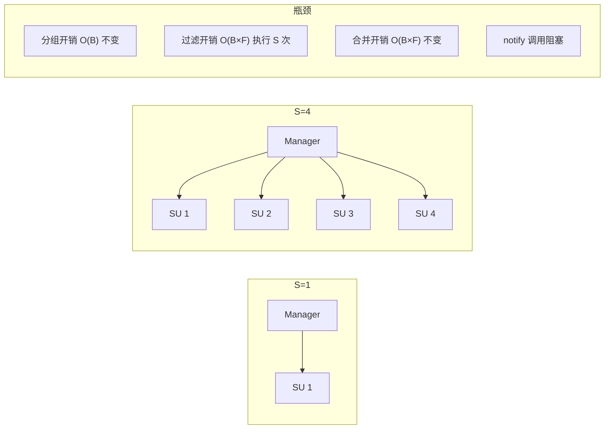
```mermaid
graph LR
    subgraph "S=1"
        A1[Manager] --> B1[SU 1]
    end
    
    subgraph "S=4"
        A2[Manager] --> B2[SU 1]
        A2 --> B3[SU 2]
        A2 --> B4[SU 3]
        A2 --> B5[SU 4]
    end
    
    subgraph "瓶颈"
        C1["分组开销 O(B) 不变"]
        C2["过滤开销 O(B×F) 执行 S 次"]
        C3["合并开销 O(B×F) 不变"]
        C4["notify 调用阻塞"]
    end
```

| S 增加时 | TQ 表现 | TD 表现 |
|----------|---------|---------|
| **分组计算** | `build_storage_meta_groups()` 每次请求重算 O(B) | `gid_to_shard` 预计算，查表 O(1) |
| **数据过滤** | `_filter_storage_data()` 对每个 group 执行 | 直接切片，无过滤 |
| **结果合并** | 三层循环 O(S × B/S × F) = O(B×F) | 单层遍历 O(B×F) |
| **元数据开销** | 每个 sample 独立 SampleMeta/FieldMeta | 无客户端元数据 |
| **网络调用** | `notify_data_update()` 每次阻塞 | 异步通知，不阻塞 |

> **警告**: TQ 的 O(B×F) 开销在 put 和 get 中各出现 **4 次**，且其中部分操作是**串行阻塞**的，无法通过增加 StorageUnit 并行化。

### 3.4 TQ 全链路阻塞点详解

TQ 存在**多层级串行阻塞**，这些阻塞点分布在 Controller、Manager、Client 和 StorageUnit 四个层级，形成完整的阻塞链路。

#### 阻塞架构总览

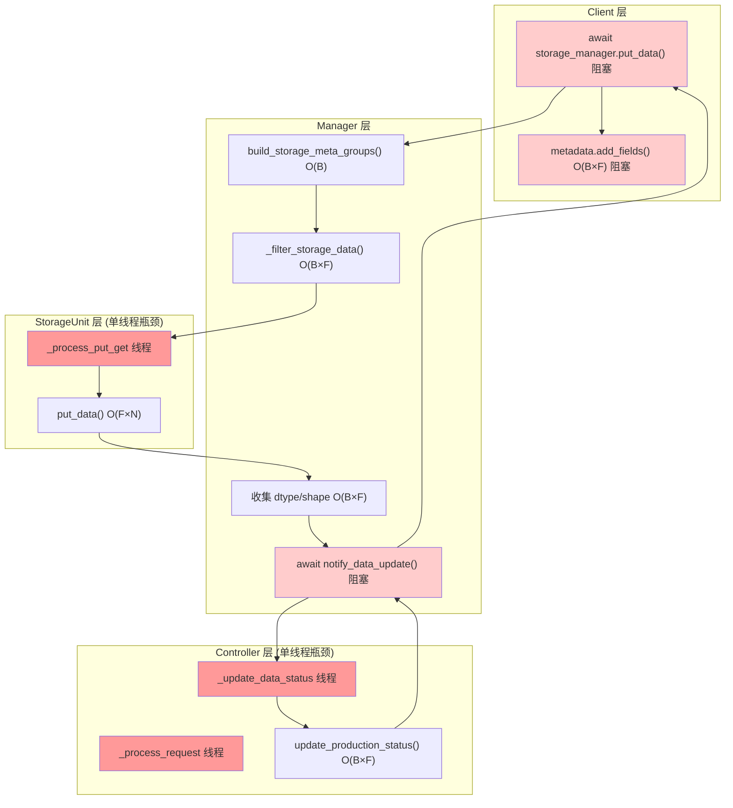
```mermaid
flowchart TB
    subgraph Client ["Client 层"]
        C1["await storage_manager.put_data() 阻塞"]
        C2["metadata.add_fields() O(B×F) 阻塞"]
    end
    
    subgraph Manager ["Manager 层"]
        M1["build_storage_meta_groups() O(B)"]
        M2["_filter_storage_data() O(B×F)"]
        M3["收集 dtype/shape O(B×F)"]
        M4["await notify_data_update() 阻塞"]
    end
    
    subgraph Controller ["Controller 层 (单线程瓶颈)"]
        CT1["_update_data_status 线程"]
        CT2["_process_request 线程"]
        CT3["update_production_status() O(B×F)"]
    end
    
    subgraph StorageUnit ["StorageUnit 层 (单线程瓶颈)"]
        SU1["_process_put_get 线程"]
        SU2["put_data() O(F×N)"]
    end
    
    C1 --> M1 --> M2 --> SU1
    SU1 --> SU2
    SU2 --> M3 --> M4
    M4 --> CT1 --> CT3
    CT3 --> M4
    M4 --> C1 --> C2
    
    style C1 fill:#ffcccc
    style C2 fill:#ffcccc
    style M4 fill:#ffcccc
    style CT1 fill:#ff9999
    style CT2 fill:#ff9999
    style SU1 fill:#ff9999
```

#### 阻塞点 1: Controller 单线程处理 (`_update_data_status`)

Controller 的 `_update_data_status` 方法在单独的守护线程中运行：

```python
def _start_process_update_data_status(self):
    """Start the data status update processing thread."""
    self.process_update_data_status_thread = Thread(
        target=self._update_data_status,  # 单线程处理所有 notify 请求
        name="TransferQueueControllerProcessUpdateDataStatusThread",
        daemon=True,
    )
    self.process_update_data_status_thread.start()
```

处理逻辑：

```python
def _update_data_status(self):
    while True:
        messages = self.data_status_update_socket.recv_multipart()  # 同步阻塞接收
        # ...
        if request_msg.request_type == ZMQRequestType.NOTIFY_DATA_UPDATE:
            success = self.update_production_status(  # O(B×F) 处理
                partition_id=partition_id,
                global_indexes=message_data.get("global_indexes", []),
                field_names=message_data.get("fields", []),
                dtypes=message_data.get("dtypes", {}),
                shapes=message_data.get("shapes", {}),
            )
            # 发送 ACK 后才能处理下一个请求
            self.data_status_update_socket.send_multipart([identity, *response_msg.serialize()])
```

**问题分析**:
- 单线程串行处理所有来自 Manager 的 `NOTIFY_DATA_UPDATE` 请求
- 每个请求内部调用 `update_production_status()` 包含 O(B×F) 复杂度
- **随着并发 Manager 数量增加，Controller 成为中心瓶颈**

#### 阻塞点 2: Controller 单线程处理 (`_process_request`)

Controller 的 `_process_request` 方法同样在单独的守护线程中运行：

```python
def _start_process_request(self):
    """Start the request processing thread."""
    self.process_request_thread = Thread(
        target=self._process_request,  # 单线程处理所有元数据请求
        name="TransferQueueControllerProcessRequestThread", 
        daemon=True
    )
    self.process_request_thread.start()
```

处理逻辑：

```python
def _process_request(self):
    while True:
        messages = self.request_handle_socket.recv_multipart()  # 同步阻塞接收
        # 处理 GET_META, CLEAR_META, CHECK_CONSUMPTION 等请求
        if request_msg.request_type == ZMQRequestType.GET_META:
            metadata = self.get_metadata(...)  # 可能包含 time.sleep() 轮询等待
```

**问题分析**:
- `get_metadata()` 在 `mode="fetch"` 时可能触发 `time.sleep()` 等待数据就绪
- 单线程处理意味着一个慢请求会阻塞所有后续请求
- GET_META 和 CLEAR_META 共用同一线程，互相阻塞

#### 阻塞点 3: StorageUnit 单线程处理 (`_process_put_get`)

每个 StorageUnit 只有一个线程处理所有 PUT/GET 请求：

```python
def _start_process_put_get(self):
    """Create a daemon thread and start put/get process."""
    self.put_get_thread = Thread(
        target=self._process_put_get,  # 单线程处理所有 PUT/GET 请求
        name="SimpleStorageUnitPutGetThread",
        daemon=True,
    )
    self.put_get_thread.start()

def _process_put_get(self):
    while True:
        socks = dict(self.put_get_poller.poll(TQ_STORAGE_POLLER_TIMEOUT * 1000))
        if self.put_get_socket in socks:
            messages = self.put_get_socket.recv_multipart()  # 同步接收
            # 串行处理 PUT 或 GET
            if request_msg.request_type == ZMQRequestType.PUT_DATA:
                response_msg = self._handle_put(request_msg)  # O(F×N)
            elif request_msg.request_type == ZMQRequestType.GET_DATA:
                response_msg = self._handle_get(request_msg)  # O(F×N)
            self.put_get_socket.send_multipart(...)
```

**问题分析**:
- 每个 StorageUnit 只有一个处理线程
- PUT 和 GET 请求串行处理，互相阻塞
- 当 Manager 并行发送请求时，StorageUnit 成为吞吐瓶颈

#### 阻塞点 4: Manager `notify_data_update()` 同步等待 ACK

Manager 的 `notify_data_update()` 虽然声明为 async 函数，但内部使用同步轮询：

```python
async def notify_data_update(self, partition_id, fields, global_indexes, dtypes, shapes):
    # 发送请求
    self.data_status_update_socket.send_multipart(request_msg)
    
    # 同步轮询等待 ACK，最长 30 秒
    response_received = False
    start_time = time.time()
    while (
        not response_received
        and time.time() - start_time < TQ_DATA_UPDATE_RESPONSE_TIMEOUT  # 30s
    ):
        socks = dict(poller.poll(TQ_STORAGE_POLLER_TIMEOUT * 1000))  # 5s
        if self.data_status_update_socket in socks:
            response_msg = ZMQMessage.deserialize(...)
            if response_msg.request_type == ZMQRequestType.NOTIFY_DATA_UPDATE_ACK:
                response_received = True
```

**问题分析**:
- **虽然是 async 函数，但内部使用同步 `zmq.Poller`**
- 调用方必须等待 Controller 处理完成并返回 ACK
- Controller 处理慢会直接阻塞 Manager 的 `put_data()` 返回

#### 阻塞点 5: Client `add_fields()` 同步元数据更新

Client 在 `async_put` 返回前还需执行同步的元数据更新：

```python
async def async_put(self, data, metadata=None, partition_id=None):
    # ...
    await self.storage_manager.put_data(data, metadata)  # 包含 notify_data_update 等待
    
    # put 完成后，Client 仍需执行元数据更新
    metadata = metadata.add_fields(data)  # O(B×F) 同步操作
```

`add_fields` 内部实现：

```python
def add_fields(self, tensor_dict, set_all_ready=True):
    # _extract_field_metas - O(B × F) 双层循环
    fields = _extract_field_metas(tensor_dict, set_all_ready)
    
    # 遍历所有 samples 更新 - O(B × F)
    for idx, sample in enumerate(self.samples):
        sample.add_fields(fields=fields[idx])
    return self
```

#### 阻塞问题汇总表

| 阻塞点 | 位置 | 类型 | 复杂度 | 影响范围 |
|--------|------|------|--------|----------|
| `_update_data_status` | Controller | 单线程 | O(B×F) | 所有 Manager 的 notify 请求 |
| `_process_request` | Controller | 单线程 | O(B×F) 含轮询 | 所有 Client 的 meta 请求 |
| `_process_put_get` | StorageUnit | 单线程 | O(F×N) | 该 SU 的所有 PUT/GET |
| `notify_data_update` | Manager → Controller | 同步 RPC | 网络 + O(B×F) | Manager 的 put_data 返回 |
| `add_fields` | Client | 同步处理 | O(B×F) | Client 的 async_put 返回 |

> **核心问题**:
> 1. Controller 两个单线程处理所有请求，是**全局中心瓶颈**
> 2. StorageUnit 单线程处理 PUT/GET，是**局部瓶颈**
> 3. Manager 的 `notify_data_update()` 同步等待，将 Controller 瓶颈**传导到调用方**
> 4. 即使增加 StorageUnit 数量，Controller 的单线程处理仍然是上限

#### TD 对比 - 无中心阻塞

```python
# TD put_experience_async - 状态更新是异步的，不阻塞 Client
await sock.send_multipart([b'PUT', header_bytes] + payload_frames)
recv_futures.append(sock.recv())  # 仅等待存储 ACK

# Shard 端异步通知 Manager，不阻塞响应
asyncio.create_task(self.manager.update_data_status.remote(...))
```

| 对比项 | TQ | TD |
|--------|----|----|
| 状态更新 | 同步 RPC，等待 Controller ACK | 异步 Ray remote，不阻塞 |
| Controller/Manager | 单线程串行处理 | Ray Actor 可并发 |
| 元数据更新 | Client 端 O(B×F) `add_fields()` | 无，Client 不持有状态 |
| StorageUnit/Shard | 单线程 | ZMQ ROUTER + 异步处理 |

### 3.5 TQ async_put 时序图

下图中标注"阻塞"的步骤表示 **阻塞等待 (await)**，串行执行无法并行。

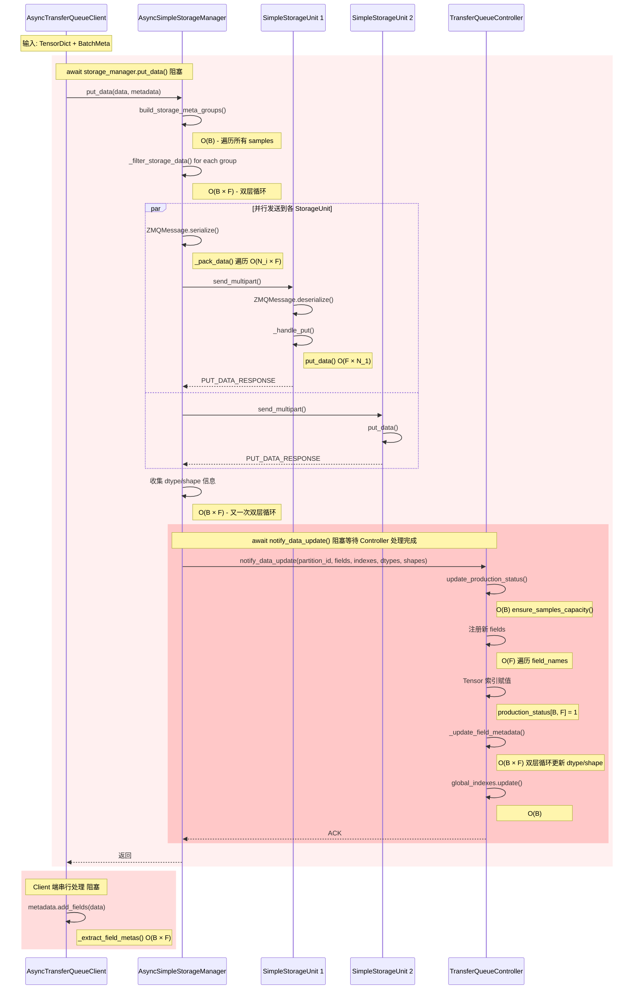
```mermaid
sequenceDiagram
    participant Client as AsyncTransferQueueClient
    participant Manager as AsyncSimpleStorageManager
    participant SU1 as SimpleStorageUnit 1
    participant SU2 as SimpleStorageUnit 2
    participant Controller as TransferQueueController
    
    Note over Client: 输入: TensorDict + BatchMeta
    
    rect rgb(255, 240, 240)
        Note over Client,Manager: await storage_manager.put_data() 阻塞
        Client->>Manager: put_data(data, metadata)
        
        Manager->>Manager: build_storage_meta_groups()
        Note right of Manager: O(B) - 遍历所有 samples
        
        Manager->>Manager: _filter_storage_data() for each group
        Note right of Manager: O(B × F) - 双层循环
        
        par 并行发送到各 StorageUnit
            Manager->>Manager: ZMQMessage.serialize()
            Note right of Manager: _pack_data() 遍历 O(N_i × F)
            Manager->>SU1: send_multipart()
            SU1->>SU1: ZMQMessage.deserialize()
            SU1->>SU1: _handle_put()
            Note right of SU1: put_data() O(F × N_1)
            SU1-->>Manager: PUT_DATA_RESPONSE
        and
            Manager->>SU2: send_multipart()
            SU2->>SU2: put_data()
            SU2-->>Manager: PUT_DATA_RESPONSE
        end
        
        Manager->>Manager: 收集 dtype/shape 信息
        Note right of Manager: O(B × F) - 又一次双层循环
        
        rect rgb(255, 200, 200)
            Note over Manager,Controller: await notify_data_update() 阻塞等待 Controller 处理完成
            Manager->>Controller: notify_data_update(partition_id, fields, indexes, dtypes, shapes)
            
            Controller->>Controller: update_production_status()
            Note right of Controller: O(B) ensure_samples_capacity()
            
            Controller->>Controller: 注册新 fields
            Note right of Controller: O(F) 遍历 field_names
            
            Controller->>Controller: Tensor 索引赋值
            Note right of Controller: production_status[B, F] = 1
            
            Controller->>Controller: _update_field_metadata()
            Note right of Controller: O(B × F) 双层循环更新 dtype/shape
            
            Controller->>Controller: global_indexes.update()
            Note right of Controller: O(B)
            
            Controller-->>Manager: ACK
        end
        
        Manager-->>Client: 返回
    end
    
    rect rgb(255, 220, 220)
        Note over Client: Client 端串行处理 阻塞
        Client->>Client: metadata.add_fields(data)
        Note right of Client: _extract_field_metas() O(B × F)
    end
```

### 3.6 TQ async_get_data 时序图

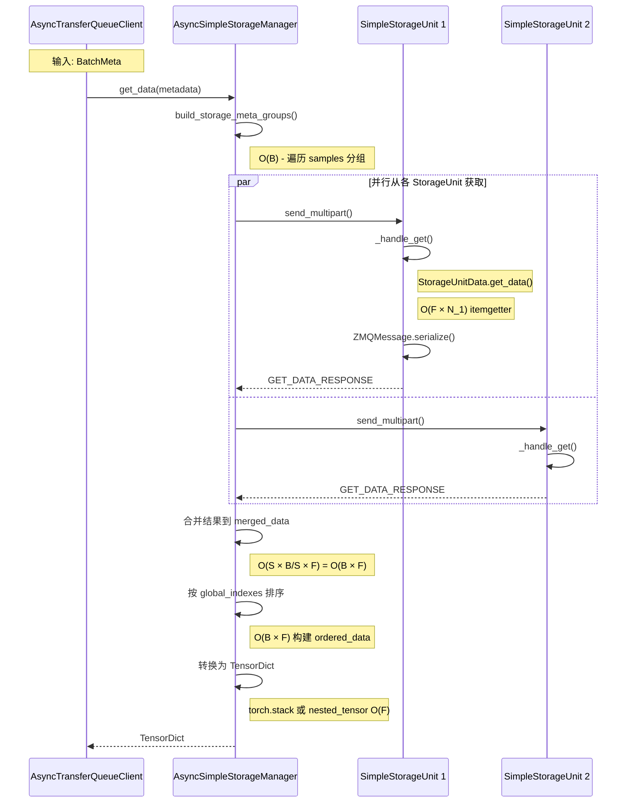
```mermaid
sequenceDiagram
    participant Client as AsyncTransferQueueClient
    participant Manager as AsyncSimpleStorageManager
    participant SU1 as SimpleStorageUnit 1
    participant SU2 as SimpleStorageUnit 2
    
    Note over Client: 输入: BatchMeta
    
    Client->>Manager: get_data(metadata)
    
    Manager->>Manager: build_storage_meta_groups()
    Note right of Manager: O(B) - 遍历 samples 分组
    
    par 并行从各 StorageUnit 获取
        Manager->>SU1: send_multipart()
        SU1->>SU1: _handle_get()
        Note right of SU1: StorageUnitData.get_data()
        Note right of SU1: O(F × N_1) itemgetter
        SU1->>SU1: ZMQMessage.serialize()
        SU1-->>Manager: GET_DATA_RESPONSE
    and
        Manager->>SU2: send_multipart()
        SU2->>SU2: _handle_get()
        SU2-->>Manager: GET_DATA_RESPONSE
    end
    
    Manager->>Manager: 合并结果到 merged_data
    Note right of Manager: O(S × B/S × F) = O(B × F)
    
    Manager->>Manager: 按 global_indexes 排序
    Note right of Manager: O(B × F) 构建 ordered_data
    
    Manager->>Manager: 转换为 TensorDict
    Note right of Manager: torch.stack 或 nested_tensor O(F)
    
    Manager-->>Client: TensorDict
```

### 3.7 TQ 关键操作复杂度

| 阶段 | 函数/操作 | 复杂度 | 说明 |
|------|----------|--------|------|
| **Manager put** | `build_storage_meta_groups()` | O(B) | 遍历 B 个 samples |
| **Manager put** | `_filter_storage_data()` | O(B × F) | S 个组，每组遍历 F 个 fields |
| **序列化** | `_pack_data()` | O(T) | T = 所有 Tensor 元素总数 |
| **存储写入** | `StorageUnitData.put_data()` | O(F × N) | F 个 fields，N 个 indexes |
| **Client** | `metadata.add_fields()` | O(B × F) | 提取并更新 FieldMeta |
| **Manager get** | 结果合并 | O(B × F) | 三层循环 |
| **Manager get** | `torch.stack()` | O(F × B) | 每个 field 处理 B 个 tensor |

---

## 4. TD put_experience 流程分析

### 4.1 完整时序图

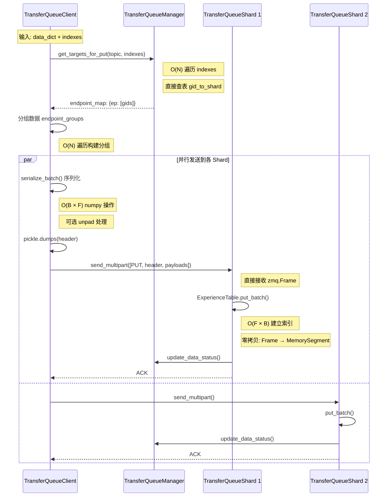
```mermaid
sequenceDiagram
    participant Client as TransferQueueClient
    participant Manager as TransferQueueManager
    participant Shard1 as TransferQueueShard 1
    participant Shard2 as TransferQueueShard 2
    
    Note over Client: 输入: data_dict + indexes
    
    %% Step 1: Get routing info
    Client->>Manager: get_targets_for_put(topic, indexes)
    Note right of Manager: O(N) 遍历 indexes
    Note right of Manager: 直接查表 gid_to_shard
    Manager-->>Client: endpoint_map: {ep: [gids]}
    
    %% Step 2: Prepare data (Client side)
    Client->>Client: 分组数据 endpoint_groups
    Note right of Client: O(N) 遍历构建分组
    
    %% Step 3: Parallel send
    par 并行发送到各 Shard
        Client->>Client: serialize_batch() 序列化
        Note right of Client: O(B × F) numpy 操作
        Note right of Client: 可选 unpad 处理
        Client->>Client: pickle.dumps(header)
        Client->>Shard1: send_multipart([PUT, header, payloads])
        Note right of Shard1: 直接接收 zmq.Frame
        Shard1->>Shard1: ExperienceTable.put_batch()
        Note right of Shard1: O(F × B) 建立索引
        Note right of Shard1: 零拷贝: Frame → MemorySegment
        Shard1->>Manager: update_data_status()
        Shard1-->>Client: ACK
    and
        Client->>Shard2: send_multipart()
        Shard2->>Shard2: put_batch()
        Shard2->>Manager: update_data_status()
        Shard2-->>Client: ACK
    end
```

### 4.2 数据转换流程图

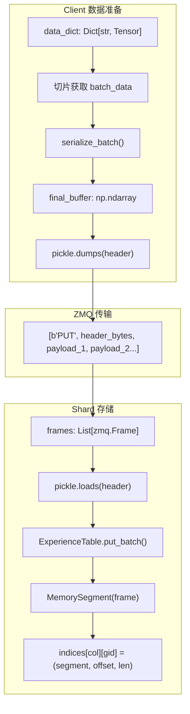
```mermaid
flowchart TD
    subgraph Client ["Client 数据准备"]
        A["data_dict: Dict[str, Tensor]"]
        B["切片获取 batch_data"]
        C["serialize_batch()"]
        D["final_buffer: np.ndarray"]
        E["pickle.dumps(header)"]
    end
    
    subgraph Network ["ZMQ 传输"]
        F["[b'PUT', header_bytes, payload_1, payload_2...]"]
    end
    
    subgraph Shard ["Shard 存储"]
        G["frames: List[zmq.Frame]"]
        H["pickle.loads(header)"]
        I["ExperienceTable.put_batch()"]
        J["MemorySegment(frame)"]
        K["indices[col][gid] = (segment, offset, len)"]
    end
    
    A --> B --> C --> D
    D --> E --> F
    F --> G --> H --> I
    I --> J --> K
```

### 4.3 关键代码路径复杂度

| 阶段 | 函数 | 复杂度 | 说明 |
|-----|------|--------|------|
| **Client 层** | | | |
| 路由查询 | `get_targets_for_put()` | O(N) | N = indexes 数量，查表 |
| 分组 | `endpoint_groups` 构建 | O(N) | 遍历 route_map |
| Micro-batch 切片 | `items[i:i+segment_size]` | O(1) | 切片操作 |
| 序列化 | `serialize_batch()` | O(B × L) | B = batch_size, L = seq_len |
| Header 打包 | `pickle.dumps()` | O(F) | F = fields 数量 |
| **Shard 层** | | | |
| 协议解析 | `pickle.loads(header)` | O(F) | 解析 header |
| 批量写入 | `put_batch()` | O(F × B) | 遍历 col × batch |
| 索引建立 | `indices[col][gid] = entry` | O(1) | 哈希表插入 |

> **总时间复杂度**: O(N + B × L) - 主要受数据序列化支配

---

## 5. TD get_experience 流程分析

### 5.1 完整时序图

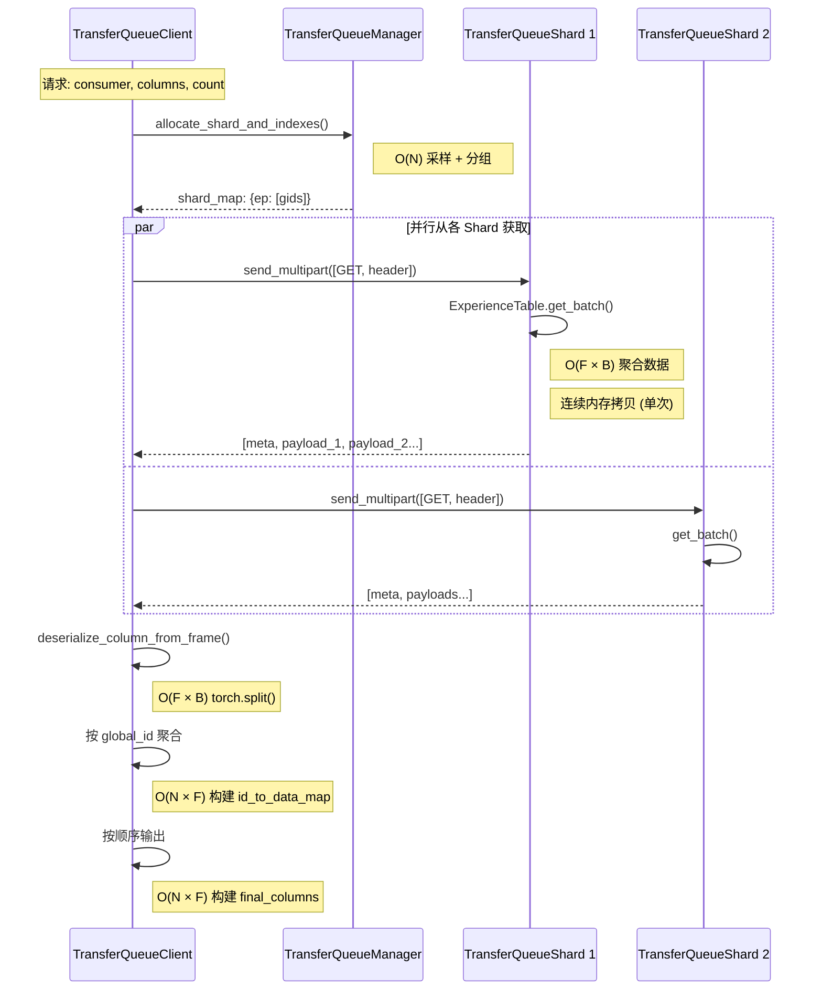
```mermaid
sequenceDiagram
    participant Client as TransferQueueClient
    participant Manager as TransferQueueManager
    participant Shard1 as TransferQueueShard 1
    participant Shard2 as TransferQueueShard 2
    
    Note over Client: 请求: consumer, columns, count
    
    %% Step 1: Allocate indexes
    Client->>Manager: allocate_shard_and_indexes()
    Note right of Manager: O(N) 采样 + 分组
    Manager-->>Client: shard_map: {ep: [gids]}
    
    %% Step 2: Parallel fetch
    par 并行从各 Shard 获取
        Client->>Shard1: send_multipart([GET, header])
        Shard1->>Shard1: ExperienceTable.get_batch()
        Note right of Shard1: O(F × B) 聚合数据
        Note right of Shard1: 连续内存拷贝 (单次)
        Shard1-->>Client: [meta, payload_1, payload_2...]
    and
        Client->>Shard2: send_multipart([GET, header])
        Shard2->>Shard2: get_batch()
        Shard2-->>Client: [meta, payloads...]
    end
    
    %% Step 3: Client merge
    Client->>Client: deserialize_column_from_frame()
    Note right of Client: O(F × B) torch.split()
    
    Client->>Client: 按 global_id 聚合
    Note right of Client: O(N × F) 构建 id_to_data_map
    
    Client->>Client: 按顺序输出
    Note right of Client: O(N × F) 构建 final_columns
```

### 5.2 数据聚合流程

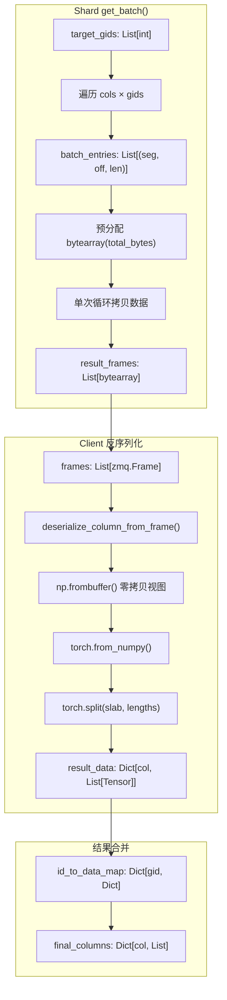
```mermaid
flowchart TD
    subgraph Shard ["Shard get_batch()"]
        A["target_gids: List[int]"]
        B["遍历 cols × gids"]
        C["batch_entries: List[(seg, off, len)]"]
        D["预分配 bytearray(total_bytes)"]
        E["单次循环拷贝数据"]
        F["result_frames: List[bytearray]"]
    end
    
    subgraph Client ["Client 反序列化"]
        G["frames: List[zmq.Frame]"]
        H["deserialize_column_from_frame()"]
        I["np.frombuffer() 零拷贝视图"]
        J["torch.from_numpy()"]
        K["torch.split(slab, lengths)"]
        L["result_data: Dict[col, List[Tensor]]"]
    end
    
    subgraph Merge ["结果合并"]
        M["id_to_data_map: Dict[gid, Dict]"]
        N["final_columns: Dict[col, List]"]
    end
    
    A --> B --> C --> D --> E --> F
    F --> G --> H --> I --> J --> K --> L
    L --> M --> N
```

### 5.3 关键代码路径复杂度

| 阶段 | 函数 | 复杂度 | 说明 |
|-----|------|--------|------|
| **Manager 层** | | | |
| 索引分配 | `allocate_shard_and_indexes()` | O(N) | N = experience_count |
| 采样 | `_sample_ready_index_n_samples()` | O(R) | R = ready_indexes 数 |
| **Shard 层** | | | |
| 数据聚合 | `get_batch()` | O(F × B) | B = batch_size |
| 内存拷贝 | `bytearray` 拼接 | O(T) | T = 总数据量 |
| **Client 层** | | | |
| 反序列化 | `deserialize_column_from_frame()` | O(F) | 每列一次 split |
| 结果合并 | `id_to_data_map` | O(N × F) | 构建查找表 |
| 排序输出 | `final_columns` | O(N × F) | 按顺序构建 |

> **总时间复杂度**: O(N × F + T) - 线性复杂度

---

## 6. TD vs TQ 详细对比

### 6.1 架构设计对比

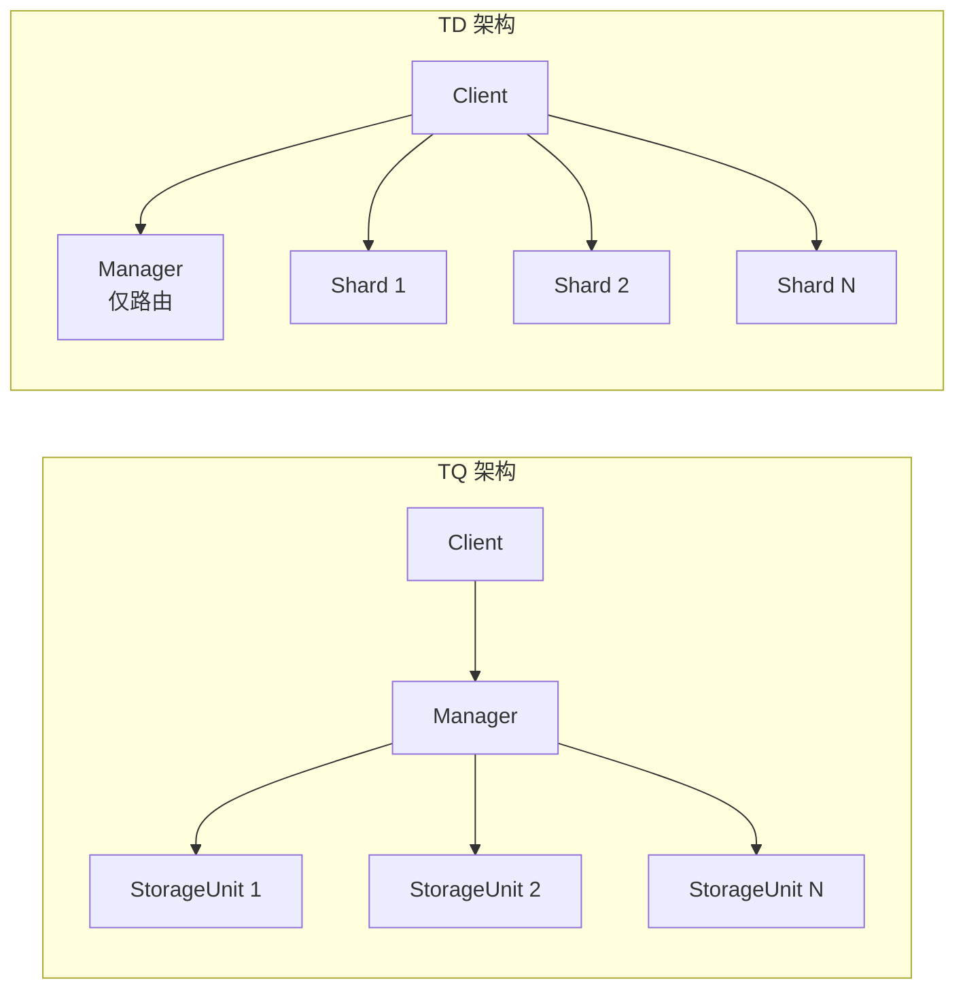
```mermaid
flowchart LR
    subgraph TQ ["TQ 架构"]
        direction TB
        TQ_C[Client] --> TQ_M[Manager]
        TQ_M --> TQ_S1[StorageUnit 1]
        TQ_M --> TQ_S2[StorageUnit 2]
        TQ_M --> TQ_S3[StorageUnit N]
    end
    
    subgraph TD ["TD 架构"]
        direction TB
        TD_C[Client] --> TD_MGR[Manager<br/>仅路由]
        TD_C --> TD_D1[Shard 1]
        TD_C --> TD_D2[Shard 2]
        TD_C --> TD_D3[Shard N]
    end
```

| 维度 | TQ | TD | TD 优势 |
|------|----|----|---------|| **数据路径** | Client → Controller → Manager → StorageUnit | Client → (Manager 路由) → Shard 直连 | 减少一跳，降低延迟 |
| **元数据管理** | 复杂 BatchMeta/SampleMeta/FieldMeta 层级 | 轻量 TopicMeta + 内存映射 | 更少内存开销 |
| **分组策略** | 每次请求重新计算 `build_storage_meta_groups()` | `gid_to_shard` 预计算查表 | O(1) vs O(N) |

### 6.2 数据流对比

#### Put 操作对比

**TQ async_put 流程：**

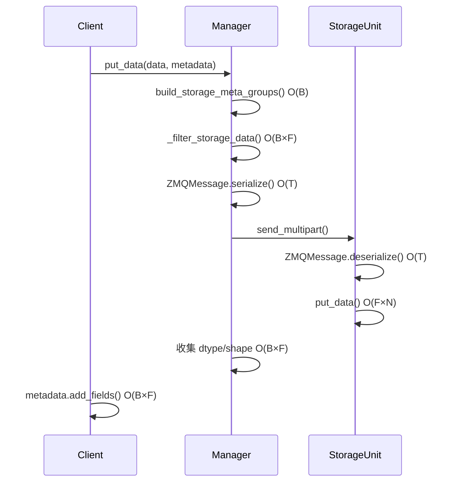
```mermaid
sequenceDiagram
    participant C as Client
    participant M as Manager
    participant S as StorageUnit
    
    C->>M: put_data(data, metadata)
    M->>M: build_storage_meta_groups() O(B)
    M->>M: _filter_storage_data() O(B×F)
    M->>M: ZMQMessage.serialize() O(T)
    M->>S: send_multipart()
    S->>S: ZMQMessage.deserialize() O(T)
    S->>S: put_data() O(F×N)
    M->>M: 收集 dtype/shape O(B×F)
    C->>C: metadata.add_fields() O(B×F)
```

**TD put_experience 流程：**

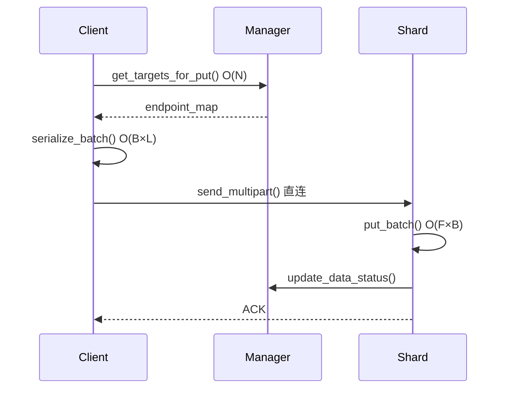
```mermaid
sequenceDiagram
    participant C as Client
    participant M as Manager
    participant S as Shard
    
    C->>M: get_targets_for_put() O(N)
    M-->>C: endpoint_map
    C->>C: serialize_batch() O(B×L)
    C->>S: send_multipart() 直连
    S->>S: put_batch() O(F×B)
    S->>M: update_data_status()
    S-->>C: ACK
```

#### Get 操作对比

**TQ async_get_data 流程：**

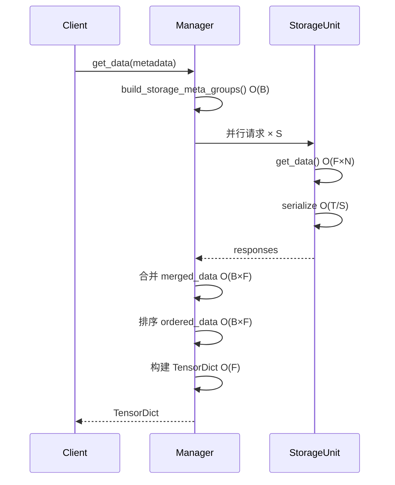
```mermaid
sequenceDiagram
    participant C as Client
    participant M as Manager
    participant S as StorageUnit
    
    C->>M: get_data(metadata)
    M->>M: build_storage_meta_groups() O(B)
    M->>S: 并行请求 × S
    S->>S: get_data() O(F×N)
    S->>S: serialize O(T/S)
    S-->>M: responses
    M->>M: 合并 merged_data O(B×F)
    M->>M: 排序 ordered_data O(B×F)
    M->>M: 构建 TensorDict O(F)
    M-->>C: TensorDict
```

**TD get_experience 流程：**

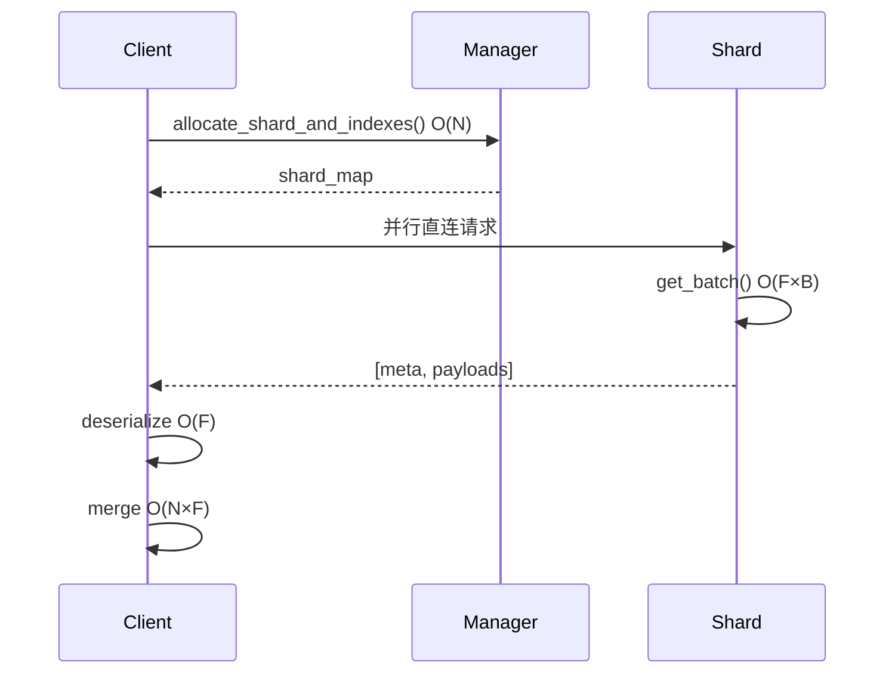
```mermaid
sequenceDiagram
    participant C as Client
    participant M as Manager
    participant S as Shard
    
    C->>M: allocate_shard_and_indexes() O(N)
    M-->>C: shard_map
    C->>S: 并行直连请求
    S->>S: get_batch() O(F×B)
    S-->>C: [meta, payloads]
    C->>C: deserialize O(F)
    C->>C: merge O(N×F)
```

### 6.3 复杂度对比总表

| 操作 | TQ 复杂度 | TD 复杂度 | 差异分析 |
|------|----------|----------|---------|
| **Put 分组** | `build_storage_meta_groups()` O(B) | `get_targets_for_put()` O(N) 查表 | TD 使用预计算映射 |
| **Put 数据过滤** | `_filter_storage_data()` O(B×F) | 切片 + `serialize_batch()` O(B) | TD 无需按 batch_index 过滤 |
| **Put 序列化** | `_pack_data()` 递归 O(T) | `pickle.dumps(header)` O(F) + numpy O(B×L) | TD 仅序列化 header |
| **Put 存储写入** | `put_data()` O(F×N) 双层循环 | `put_batch()` O(F×B) 单次遍历 | TD 批量建立索引 |
| **Put 元数据更新** | `metadata.add_fields()` O(B×F) 提取 FieldMeta | 无对应开销 | TD 无元数据更新 |
| **Get 分组** | `build_storage_meta_groups()` O(B) | `allocate_shard_and_indexes()` O(N) | 类似 |
| **Get 数据获取** | `itemgetter` O(F×N) | `get_batch()` O(F×B) | 类似 |
| **Get 结果合并** | 三层循环 O(B×F) + 排序 O(B×F) | 单层遍历 O(N×F) | TD 合并更直接 |
| **Get TensorDict** | `torch.stack` / `nested_tensor` O(F×B) | 返回 List[Tensor] | TD 避免额外转换 |

### 6.4 内存管理对比

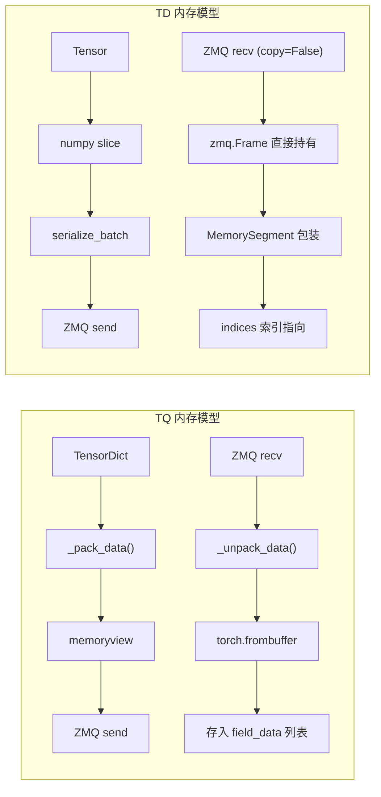
```mermaid
flowchart LR
    subgraph TQ ["TQ 内存模型"]
        TQ1["TensorDict"] --> TQ2["_pack_data()"]
        TQ2 --> TQ3["memoryview"]
        TQ3 --> TQ4["ZMQ send"]
        TQ5["ZMQ recv"] --> TQ6["_unpack_data()"]
        TQ6 --> TQ7["torch.frombuffer"]
        TQ7 --> TQ8["存入 field_data 列表"]
    end
    
    subgraph TD ["TD 内存模型"]
        TD1["Tensor"] --> TD2["numpy slice"]
        TD2 --> TD3["serialize_batch"]
        TD3 --> TD4["ZMQ send"]
        TD5["ZMQ recv (copy=False)"]
        TD5 --> TD6["zmq.Frame 直接持有"]
        TD6 --> TD7["MemorySegment 包装"]
        TD7 --> TD8["indices 索引指向"]
    end
```

| 特性 | TQ | TD |
|------|----|----|
| 存储数据形式 | 反序列化后的 Tensor 对象 | 原始 zmq.Frame + 偏移量索引 |
| 引用计数 | 无显式管理 | `MemorySegment.ref_count` |
| Prompt 复用 | 需要复制 N 份 | 单份 Frame，N 个索引共享 |
| 内存释放 | Python GC 自动 | 显式 `release()` 触发 |

---

## 7. TD 性能优势详解

### 7.1 零拷贝链路


```mermaid
flowchart LR
    subgraph Producer ["生产端"]
        A["Tensor.numpy()"] --> B["serialize_batch()"]
        B --> C["np.ndarray (连续内存)"]
    end
    
    subgraph Transport ["传输层"]
        C --> D["ZMQ send(copy=False)"]
        D --> E["网络传输"]
        E --> F["ZMQ recv(copy=False)"]
    end
    
    subgraph Storage ["存储端"]
        F --> G["zmq.Frame"]
        G --> H["MemorySegment(frame)"]
        H --> I["memoryview(frame)"]
    end
    
    subgraph Consumer ["消费端"]
        I --> J["get_batch() 切片"]
        J --> K["bytearray 拼接 (单次拷贝)"]
        K --> L["ZMQ send"]
        L --> M["np.frombuffer (零拷贝)"]
        M --> N["torch.from_numpy"]
    end
    
    style D fill:#90EE90
    style F fill:#90EE90
    style I fill:#90EE90
    style M fill:#90EE90
```

**关键零拷贝点**:
1. ZMQ send/recv with `copy=False`
2. `MemorySegment` 直接持有 Frame
3. `np.frombuffer` 创建视图
4. `torch.from_numpy` 共享内存

### 7.2 Prompt 共享机制

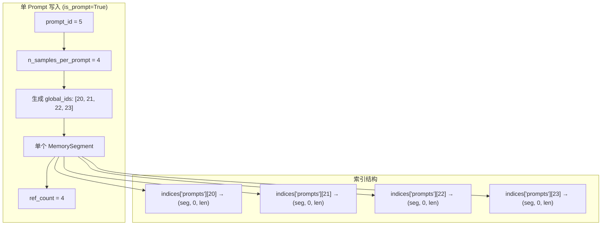
```mermaid
flowchart TD
    subgraph "单 Prompt 写入 (is_prompt=True)"
        A["prompt_id = 5"]
        B["n_samples_per_prompt = 4"]
        C["生成 global_ids: [20, 21, 22, 23]"]
        D["单个 MemorySegment"]
        E["ref_count = 4"]
    end
    
    subgraph "索引结构"
        F["indices['prompts'][20] → (seg, 0, len)"]
        G["indices['prompts'][21] → (seg, 0, len)"]
        H["indices['prompts'][22] → (seg, 0, len)"]
        I["indices['prompts'][23] → (seg, 0, len)"]
    end
    
    A --> B --> C --> D --> E
    D --> F & G & H & I
```

**TQ 对比**: TQ 无 Prompt 共享机制，每个 sample 独立存储，造成 N 倍内存浪费。

### 7.3 轻量协议设计

| 协议组成 | TQ | TD |
|----------|----|----|
| Header | `pickle(ZMQMessage)` 完整对象 | `pickle(dict)` 轻量字典 |
| Body | `_pack_data()` 递归打包 | 直接 numpy buffer |
| 元数据 | `BatchMeta` + `SampleMeta` × N + `FieldMeta` × N×F | 单层 `{columns: {col: {dtype, lengths}}}` |

```python
# TD Header 示例 (轻量)
header = {
    "topic": "Trainer",
    "indexes": [0, 1, 2, 3],
    "columns": {
        "input_ids": {"dtype": "int64", "lengths": [128, 128, 128, 128]},
        "attention_mask": {"dtype": "int64", "lengths": [128, 128, 128, 128]}
    },
    "order": ["input_ids", "attention_mask"],
    "is_prompt": False
}

# TQ ZMQMessage 示例 (复杂)
# 包含完整的 BatchMeta 对象序列化，每个 SampleMeta 又包含多个 FieldMeta
```

---

## 8. 架构优越性总结

### 8.1 性能优势

| 优势点 | 描述 | 量化收益 |
|--------|------|---------|
| **直连架构** | Client 直接连接 Shard，绕过 Manager 数据转发 | 减少 1 跳延迟 |
| **预计算路由** | `gid_to_shard` 哈希表查询 | O(N) → O(1) |
| **批量索引** | `put_batch` 单次循环建立索引 | 减少锁争用 |
| **Prompt 共享** | 单份内存 N 个引用 | 内存减少 (N-1)/N |
| **轻量协议** | 简单 dict 替代复杂对象 | 序列化开销降低 |

### 8.2 架构优势

```mermaid
mindmap
    root((TD 架构优势))
        简洁性
            单一职责分离
            Client 只做分发
            Manager 只做路由
            Shard 只做存储
        可扩展性
            Shard 水平扩展
            无中心瓶颈
        内存效率
            MemorySegment 引用计数
            zmq.Frame 生命周期管理
            Prompt 数据共享
        低延迟
            Client-Shard 直连
            异步 recv_futures
            并行 micro-batch
```

### 8.3 代码可维护性

| 维度 | TQ | TD |
|------|----|----|
| 文件数量 | 5+ (client, manager, backend, base, zmq_utils, serial_utils, metadata...) | 4 (client, mgr, data, structures) |
| 类数量 | 10+ (含 dataclass) | 5 |
| 抽象层级 | 多层继承 + Factory | 扁平结构 |
| 配置复杂度 | 需要配置 Controller + StorageUnit + Manager | 仅需配置 Shard 数量 |

---

## 9. TD 潜在劣势与改进空间

### 9.1 当前局限

| 局限 | 说明 | 可能改进方向 |
|------|------|-------------|
| Get 时单次拷贝 | `get_batch()` 需要 `bytearray` 拼接 | 可考虑 scatter-gather IO |
| Manager 单点 | Ray Actor 作为协调者 | 可增加 failover 机制 |
| 无 TensorDict | 返回 `Dict[str, List[Tensor]]` | 可按需包装 |

### 9.2 量化对比建议

后续可通过以下指标进行实际性能对比：

1. **吞吐量**: samples/sec
2. **延迟**: P50/P95/P99
3. **内存占用**: Peak RSS
4. **CPU 利用率**: 序列化/反序列化开销

---

## 10. 完整调用链

### 10.1 TD put_experience 调用链

```
put_experience_async()
├── manager.get_targets_for_put.remote()           # O(N)
├── for endpoint, items in endpoint_groups:        # O(S) 并行
│   └── _process_node_data()
│       ├── for i in range(0, len, segment_size):  # Micro-batch
│       │   ├── batch_items = items[i:i+size]      # O(1)
│       │   ├── for col, raw_data in data_dict:    # O(F)
│       │   │   └── serialize_batch()              # O(B × L)
│       │   ├── pickle.dumps(header)               # O(F)
│       │   └── sock.send_multipart()
│       └── await asyncio.gather(*recv_futures)
│
# Shard 端
├── _handle_put()
│   ├── pickle.loads(header)
│   └── table.put_batch()
│       ├── for col, frame in zip(order, frames):  # O(F)
│       │   └── MemorySegment(frame)
│       └── for gid, n_elems in zip(ids, lens):    # O(B)
│           └── indices[col][gid] = entry          # O(1)
└── manager.update_data_status.remote()
```

### 10.2 TD get_experience 调用链

```
get_experience_async()
├── manager.allocate_shard_and_indexes.remote()    # O(N + R)
│   ├── _sample_ready_index_n_samples()            # O(R)
│   └── 分组到 endpoint_map                         # O(N)
├── for endpoint, indexes in shard_map:            # O(S) 并行
│   └── _fetch_one_shard()
│       ├── pickle.dumps(req_header)               # O(1)
│       ├── sock.send_multipart()
│       ├── reply = await sock.recv_multipart()
│       │
│       # Shard 端
│       ├── _handle_get()
│       │   └── table.get_batch()
│       │       ├── for col in target_cols:        # O(F)
│       │       │   └── for gid in target_gids:    # O(B)
│       │       │       └── batch_entries.append() # O(1)
│       │       └── bytearray 拼接                  # O(T)
│       │
│       └── deserialize_column_from_frame()        # O(F)
│           └── torch.split(slab, lengths)
│
├── for res in shard_results:                      # O(S × B)
│   └── id_to_data_map[gid] = sample_pack
└── for target_id in target_iterator:              # O(N)
    └── final_columns[col].append()
```

---

*文档生成时间: 2026-01-12*
