# TD vs TQ 数据流分析对比（对比驱动版）

本文档采用**对比驱动**结构：按功能模块逐一对比 TQ 和 TD 的设计与实现，突出差异和优劣。

---

## 1. 执行摘要

### 核心发现

| 维度 | TQ | TD | 结论 |
|------|----|----|------|
| **数据路径** | Client → Controller → Manager → StorageUnit | Client → Manager(路由) → Shard 直连 | TD 减少 1 跳 |
| **状态更新** | 同步阻塞等待 ACK | 异步 Ray remote | TD 不阻塞数据路径 |
| **处理并发** | Controller/StorageUnit 单线程 | Shard 异步处理 | TD 无中心瓶颈 |
| **内存模型** | 反序列化 Tensor 存储 | zmq.Frame 零拷贝 | TD 减少拷贝开销 |
| **元数据开销** | 三级结构 O(B×F) | 无客户端状态 | TD 无此开销 |

### 性能对比（Benchmark 实测）

基于 `final_benchmark_summary_20260109_03.json` 的测试数据（TransferQueue 使用 optimized-v0.15 分支）：

| 配置 | 数据量 | TQ PUT | TD PUT | 提升 | TQ GET | TD GET | 提升 |
|------|--------|--------|--------|------|--------|--------|------|
| small | 0.05 GB | 1.56 Gbps | 11.32 Gbps | **7.3×** | 2.53 Gbps | 9.44 Gbps | **3.7×** |
| medium | 0.50 GB | 6.82 Gbps | 14.36 Gbps | **2.1×** | 6.95 Gbps | 12.94 Gbps | **1.9×** |
| large | 2.93 GB | 12.34 Gbps | 16.80 Gbps | **1.4×** | 8.41 Gbps | 14.83 Gbps | **1.8×** |
| xlarge | 5.87 GB | 11.86 Gbps | 17.88 Gbps | **1.5×** | 8.47 Gbps | 15.27 Gbps | **1.8×** |
| huge | 9.79 GB | 11.08 Gbps | 16.75 Gbps | **1.5×** | 5.50 Gbps | 14.83 Gbps | **2.7×** |

---

## 2. 架构设计对比

### 2.1 TQ 架构

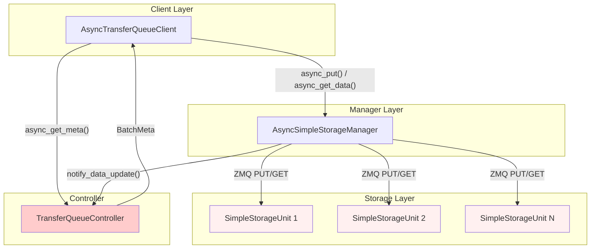

**TQ 特点**：
- 中心化 Controller 管理元数据
- Manager 作为数据代理转发请求
- StorageUnit 存储反序列化后的 Tensor

### 2.2 TD 架构

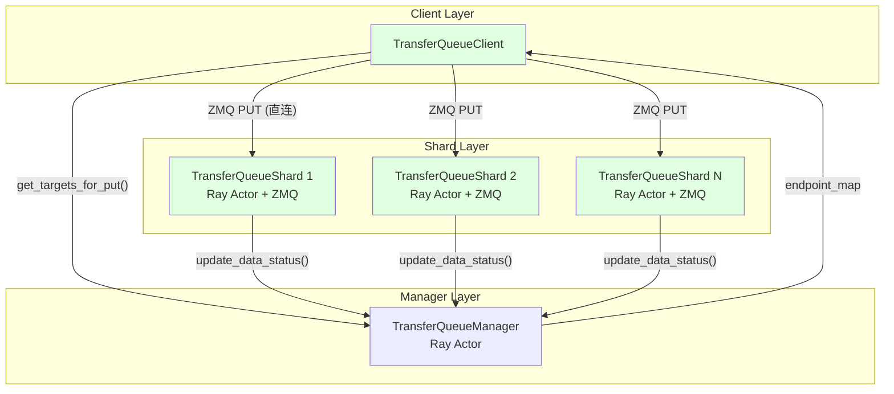

**TD 特点**：
- Manager 仅做路由，不参与数据传输
- Client 直连 Shard，减少网络跳数
- Shard 异步更新状态，不阻塞响应

### 2.3 设计理念差异

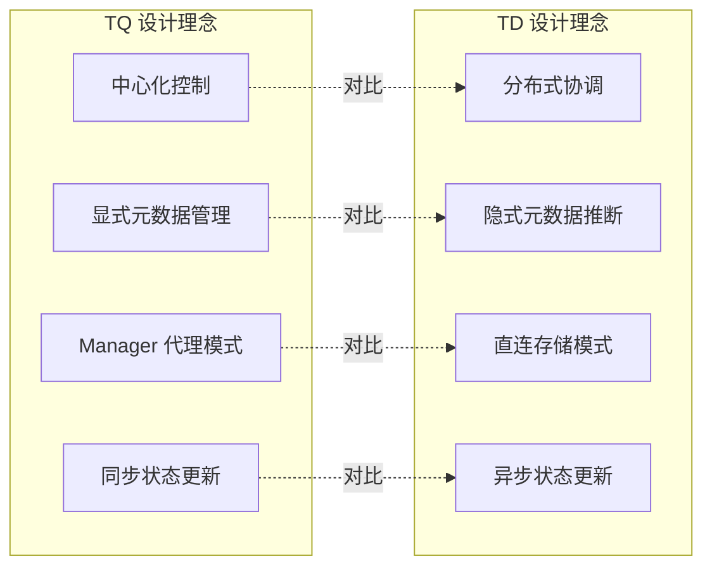

| 设计维度 | TQ | TD | 权衡分析 |
|----------|----|----|----------|
| **控制模式** | 中心化 Controller | 分布式 Manager + Shard | TQ 易于一致性，TD 易于扩展 |
| **元数据管理** | 显式三级结构 | 隐式存储在 Shard | TQ 功能丰富，TD 开销更低 |
| **数据路径** | Manager 代理 | Client 直连 | TD 减少延迟和带宽占用 |
| **状态同步** | 同步等待 ACK | 异步 Ray remote | TD 不阻塞关键路径 |

---

## 3. Put 操作深度对比

### 3.1 TQ Put 流程与瓶颈

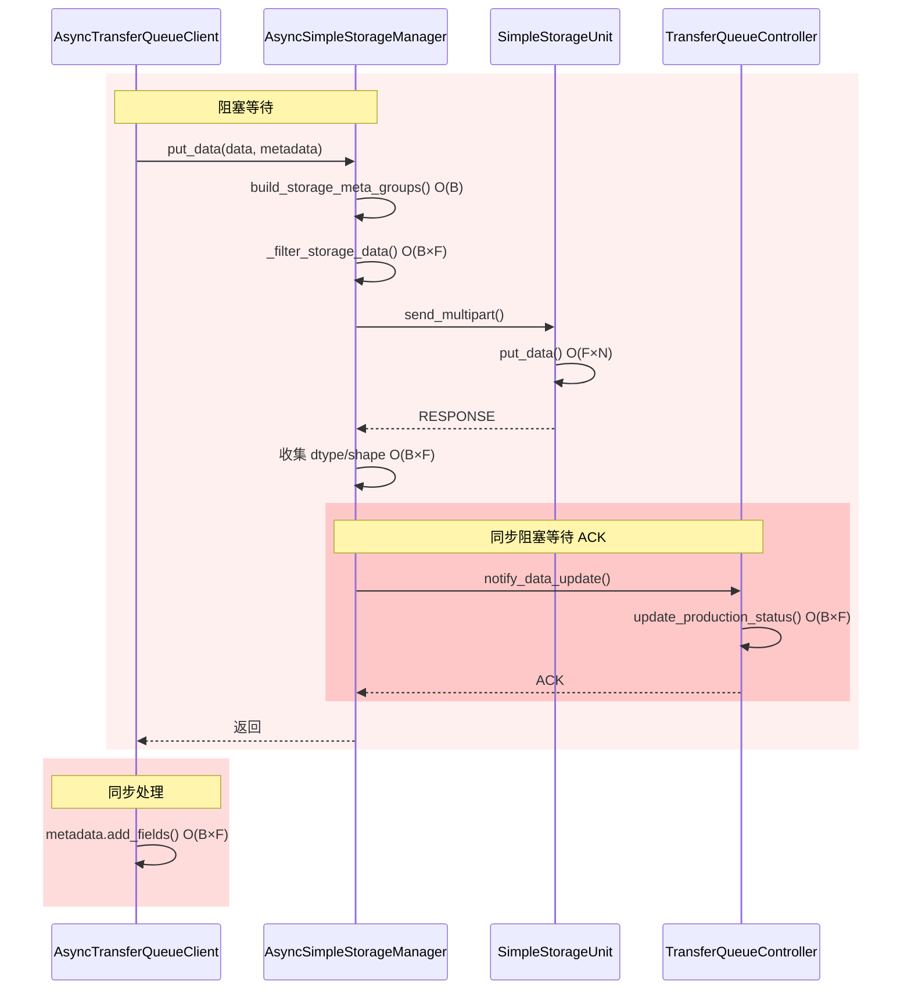

**TQ Put 瓶颈分析**：

| 瓶颈点 | 类型 | 复杂度 | 问题描述 |
|--------|------|--------|----------|
| `build_storage_meta_groups()` | 计算 | O(B) | 每次请求重新计算分组 |
| `_filter_storage_data()` | 计算 | O(B×F) | 双层循环过滤数据 |
| `notify_data_update()` | 阻塞 | 网络 + O(B×F) | 同步等待 Controller ACK |
| `update_production_status()` | 单线程 | O(B×F) | Controller 串行处理 |
| `add_fields()` | 计算 | O(B×F) | 客户端元数据更新 |

### 3.2 TD Put 流程与优化

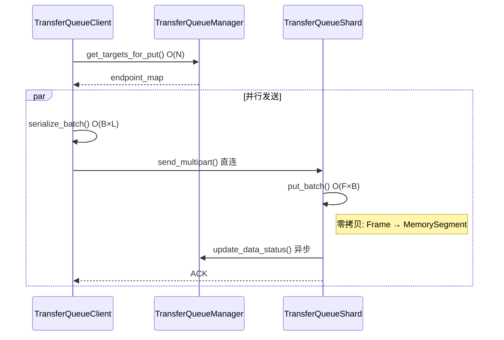

**TD Put 优化点**：

| 优化点 | 实现方式 | 收益 |
|--------|----------|------|
| 预计算路由 | `gid_to_shard` 查表 | O(B) → O(1) |
| 无数据过滤 | 直接切片发送 | 减少 O(B×F) |
| 异步状态更新 | Ray remote | 不阻塞响应 |
| 零拷贝存储 | zmq.Frame + MemorySegment | 减少内存拷贝 |
| 无客户端元数据 | 状态仅在 Manager | 减少 O(B×F) |

### 3.3 Put 复杂度与性能对比

| 阶段 | TQ | TD | 差异 |
|------|----|----|------|
| 路由/分组 | O(B) 每次计算 | O(N) 查表 | TD 预计算 |
| 数据准备 | O(B×F) 过滤 | O(1) 切片 | TD 无过滤 |
| 序列化 | O(T) 递归打包 | O(T) 直接 buffer | 相当 |
| 存储写入 | O(F×N) | O(F×B) | 相当 |
| 状态通知 | **阻塞** O(B×F) | **异步** | TD 不阻塞 |
| 元数据更新 | O(B×F) | 无 | TD 无此开销 |
| **总计** | O(T) + **5×O(B×F)** | O(T) + O(B×F) | TD 减少 4 倍 |

---

## 4. Get 操作深度对比

### 4.1 TQ Get 流程与瓶颈

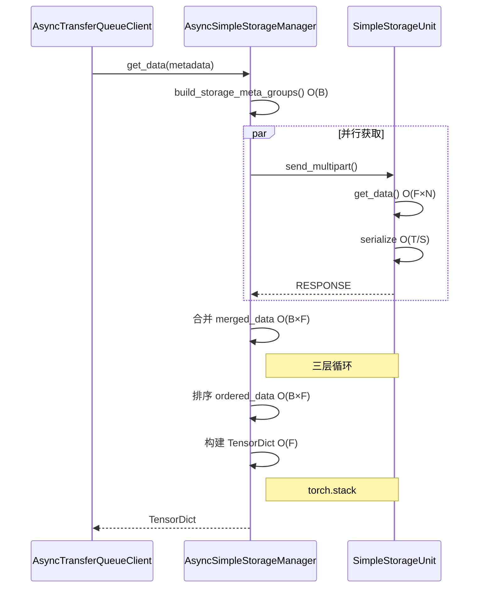

**TQ Get 瓶颈分析**：

| 瓶颈点 | 复杂度 | 问题描述 |
|--------|--------|----------|
| `build_storage_meta_groups()` | O(B) | 重复分组计算 |
| 结果合并 | O(B×F) | 三层嵌套循环 |
| 结果排序 | O(B×F) | 按 global_indexes 重排 |
| 构建 TensorDict | O(F×B) | torch.stack 额外开销 |

### 4.2 TD Get 流程与优化

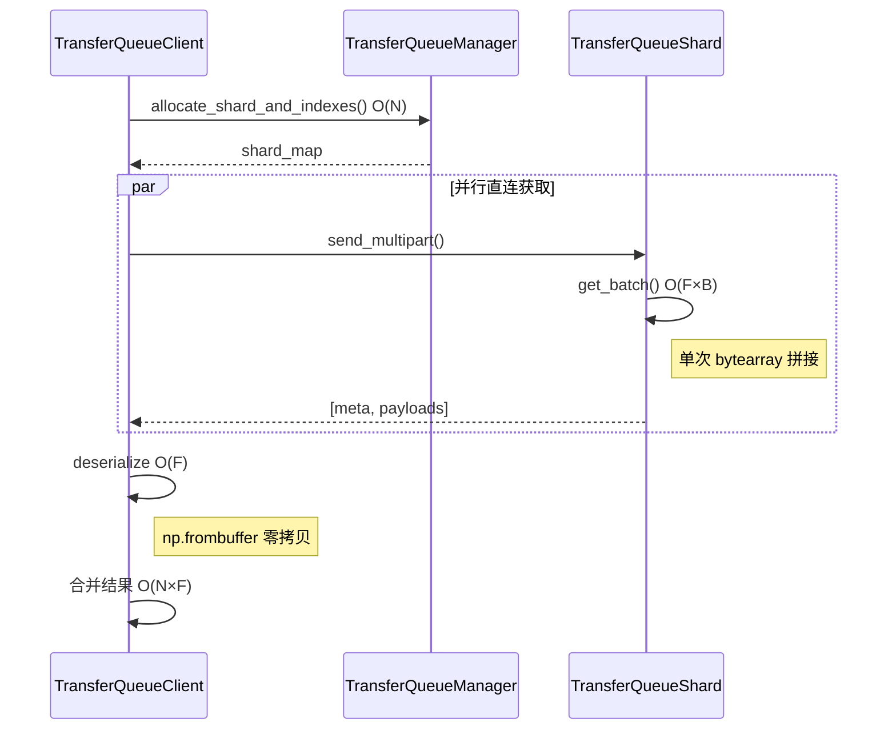

**TD Get 优化点**：

| 优化点 | 实现方式 | 收益 |
|--------|----------|------|
| 直连获取 | Client → Shard | 减少 1 跳 |
| 零拷贝反序列化 | np.frombuffer | 无内存拷贝 |
| 简化合并 | 单层遍历 | 减少循环层级 |
| 无 TensorDict | 返回 List[Tensor] | 避免额外转换 |

### 4.3 Get 复杂度与性能对比

| 阶段 | TQ | TD | 差异 |
|------|----|----|------|
| 分组/路由 | O(B) | O(N) | 类似 |
| 数据获取 | O(F×N) | O(F×B) | 类似 |
| 反序列化 | O(T) 完整解析 | O(1) 零拷贝 | TD 零拷贝 |
| 结果合并 | O(B×F) 三层循环 | O(N×F) 单层 | TD 更直接 |
| 排序 | O(B×F) | 无 | TD 无此开销 |
| 构建输出 | O(F×B) torch.stack | O(1) | TD 无转换 |
| **总计** | O(T) + **4×O(B×F)** | O(T) + **2×O(B×F)** | TD 减少一半 |

---

## 5. 阻塞与并发问题对比

### 5.1 TQ 全链路阻塞分析

TQ 存在**多层级串行阻塞**，形成完整的阻塞链路：

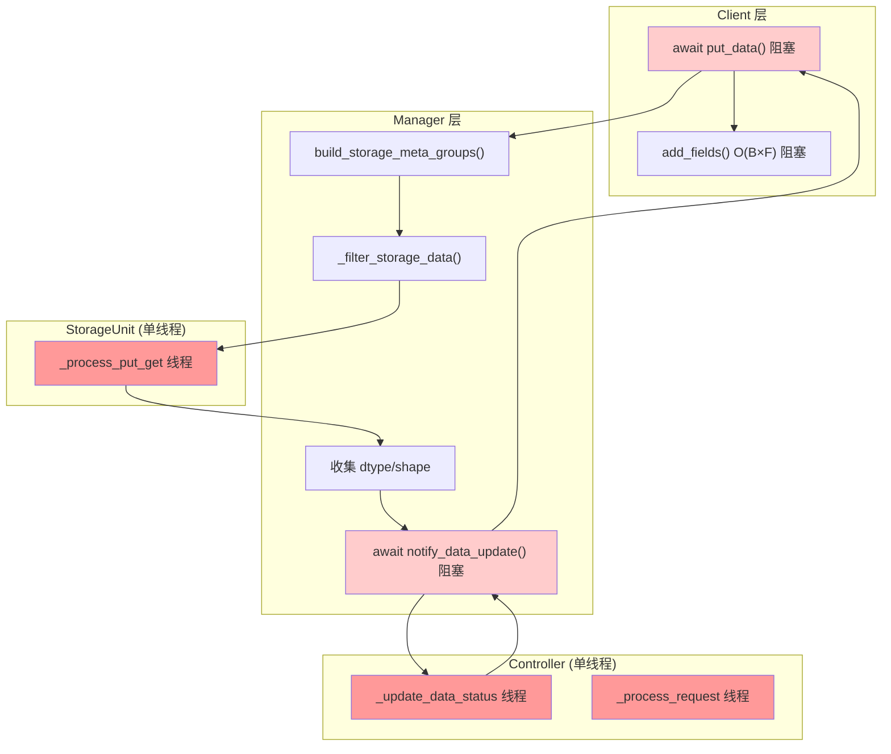

**单线程瓶颈详解**：

| 组件 | 单线程处理 | 问题 |
|------|------------|------|
| Controller `_update_data_status` | 所有 notify 请求 | 全局瓶颈，串行处理 |
| Controller `_process_request` | 所有 meta 请求 | 包含 sleep 等待，阻塞其他请求 |
| StorageUnit `_process_put_get` | 该 SU 的所有 PUT/GET | PUT 和 GET 互相阻塞 |

**阻塞传导链**：
1. Controller 单线程处理 → 
2. Manager notify 等待 ACK → 
3. Client put_data 阻塞 → 
4. Client add_fields 再阻塞

### 5.2 TD 异步处理机制

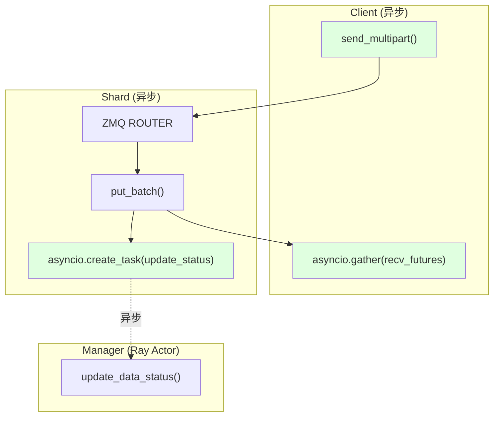

**TD 并发特点**：

| 特点 | 实现方式 | 收益 |
|------|----------|------|
| 异步状态更新 | `asyncio.create_task()` | 不阻塞数据响应 |
| 并行发送 | `asyncio.gather()` | 多 Shard 并行 |
| 无中心瓶颈 | Ray Actor 分布式 | 水平扩展 |

### 5.3 并发能力对比

| 对比项 | TQ | TD |
|--------|----|----|
| 状态更新 | 同步 RPC，等待 ACK | 异步 Ray remote |
| Controller/Manager | 单线程串行 | Ray Actor 可并发 |
| StorageUnit/Shard | 单线程 PUT/GET | ZMQ ROUTER 异步 |
| 客户端元数据 | O(B×F) add_fields | 无 |
| 扩展瓶颈 | Controller 单线程 | 无中心瓶颈 |

---

## 6. 内存管理对比

### 6.1 数据存储模型对比

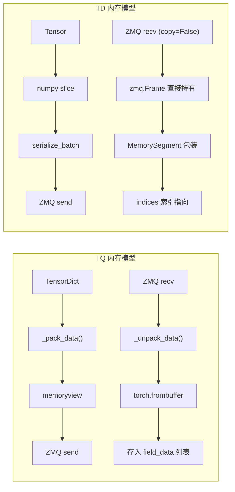

### 6.2 零拷贝实现对比

| 特性 | TQ | TD |
|------|----|----|
| 存储数据形式 | 反序列化后的 Tensor | 原始 zmq.Frame + 偏移量 |
| 接收时拷贝 | 反序列化创建新 Tensor | copy=False 直接引用 |
| 发送时拷贝 | memoryview 减少拷贝 | copy=False 零拷贝 |
| 引用计数 | Python GC | 显式 MemorySegment.ref_count |

### 6.3 Prompt 共享对比

**TD Prompt 共享机制**：

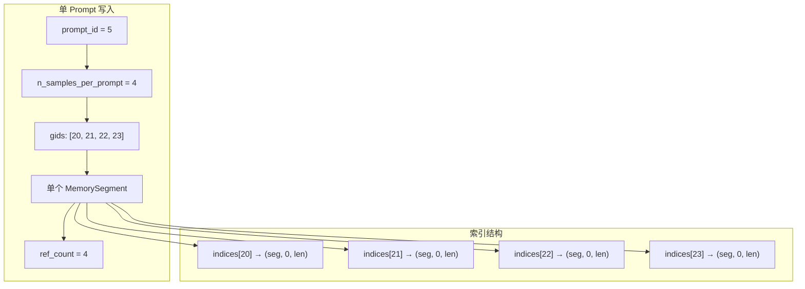

| 对比项 | TQ | TD |
|--------|----|----|
| Prompt 存储 | 每个 sample 独立存储 | 单份内存共享 |
| 内存开销 | N 倍 | 1 倍 |
| 内存节省 | 无 | (N-1)/N |

---

## 7. 核心数据结构对比

### 7.1 类图对比

#### TQ 数据结构

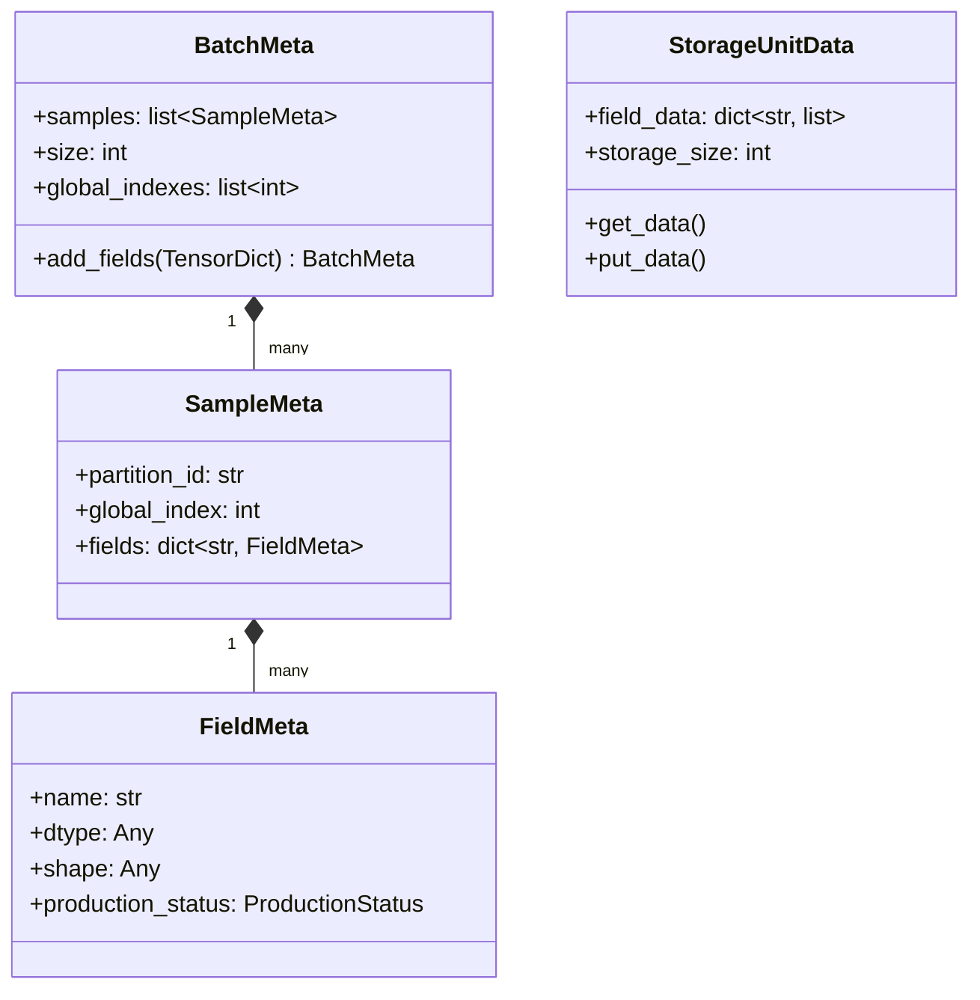

#### TD 数据结构

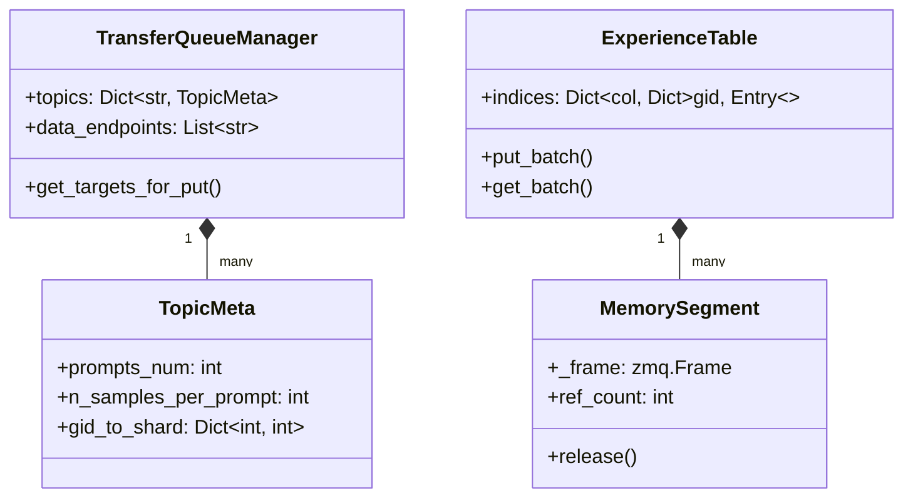

### 7.2 协议对比

| 协议组成 | TQ | TD |
|----------|----|----|
| Header | `pickle(ZMQMessage)` 完整对象 | `pickle(dict)` 轻量字典 |
| Body | `_pack_data()` 递归打包 | 直接 numpy buffer |
| 元数据 | BatchMeta + SampleMeta × N + FieldMeta × N×F | 单层 dict |

```python
# TD Header 示例 (轻量)
header = {
    "topic": "Trainer",
    "indexes": [0, 1, 2, 3],
    "columns": {
        "input_ids": {"dtype": "int64", "lengths": [128, 128, 128, 128]},
    },
    "order": ["input_ids"],
    "is_prompt": False
}
```

---

## 8. 结论与演进路径

### 8.1 TD 架构优势总结

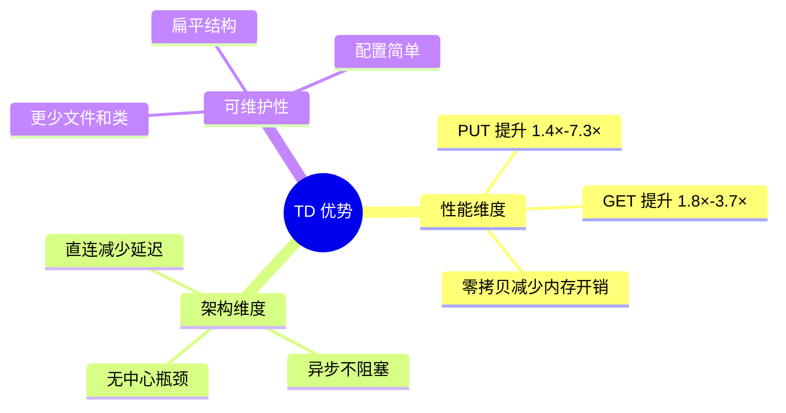

### 8.2 量化收益

| 优势点 | 量化收益 |
|--------|---------|
| 直连架构 | 减少 1 跳延迟 |
| 预计算路由 | O(B) → O(1) |
| 消除阻塞 | PUT 复杂度减少 4 倍 |
| Prompt 共享 | 内存减少 (N-1)/N |
| 轻量协议 | 序列化开销降低 |

### 8.3 代码可维护性

| 维度 | TQ | TD |
|------|----|----|
| 文件数量 | 5+ | 4 |
| 类数量 | 10+ | 5 |
| 抽象层级 | 多层继承 | 扁平结构 |
| 配置项 | Controller + StorageUnit + Manager | Shard 数量 |

### 8.4 TD 潜在改进空间

| 局限 | 改进方向 |
|------|----------|
| Get 时 bytearray 拼接 | scatter-gather IO |
| Manager 单点 | failover 机制 |
| 无 TensorDict 输出 | 按需包装 |

---

## 附录 A: Benchmark 详细数据

### PUT 操作性能

| 配置 | 数据量 | TQ Mean | TQ P99 | TD Mean | TD P99 | 提升 |
|------|--------|---------|--------|---------|--------|------|
| debug | 0.05 MB | 0.0046 Gbps | 0.0056 Gbps | 0.0124 Gbps | 0.0146 Gbps | 2.7× |
| tiny | 0.62 MB | 0.058 Gbps | 0.079 Gbps | 0.333 Gbps | 0.372 Gbps | 5.7× |
| small | 0.05 GB | 1.56 Gbps | 1.69 Gbps | 11.32 Gbps | 13.12 Gbps | 7.3× |
| medium | 0.50 GB | 6.82 Gbps | 8.21 Gbps | 14.36 Gbps | 15.88 Gbps | 2.1× |
| large | 2.93 GB | 12.34 Gbps | 13.61 Gbps | 16.80 Gbps | 19.16 Gbps | 1.4× |
| xlarge | 5.87 GB | 11.86 Gbps | 12.54 Gbps | 17.88 Gbps | 19.95 Gbps | 1.5× |
| huge | 9.79 GB | 11.08 Gbps | 12.04 Gbps | 16.75 Gbps | 19.01 Gbps | 1.5× |

### GET 操作性能

| 配置 | 数据量 | TQ Mean | TQ P99 | TD Mean | TD P99 | 提升 |
|------|--------|---------|--------|---------|--------|------|
| debug | 0.05 MB | 0.0057 Gbps | 0.0068 Gbps | 0.0159 Gbps | 0.0172 Gbps | 2.8× |
| tiny | 0.62 MB | 0.086 Gbps | 0.116 Gbps | 0.405 Gbps | 0.443 Gbps | 4.7× |
| small | 0.05 GB | 2.53 Gbps | 2.76 Gbps | 9.44 Gbps | 10.26 Gbps | 3.7× |
| medium | 0.50 GB | 6.95 Gbps | 7.73 Gbps | 12.94 Gbps | 14.20 Gbps | 1.9× |
| large | 2.93 GB | 8.41 Gbps | 9.74 Gbps | 14.83 Gbps | 15.40 Gbps | 1.8× |
| xlarge | 5.87 GB | 8.47 Gbps | 9.61 Gbps | 15.27 Gbps | 16.24 Gbps | 1.8× |
| huge | 9.79 GB | 5.50 Gbps | 6.49 Gbps | 14.83 Gbps | 15.43 Gbps | 2.7× |

---

## 附录 B: 复杂度符号说明

| 符号 | 含义 | 典型值 |
|------|------|--------|
| B | Batch Size | 64 ~ 1024 |
| F | Fields 数量 | 2 ~ 10 |
| T | Total Elements | B × SeqLen × F |
| S | Shards 数量 | 1 ~ 8 |
| N | 单 Shard 分配的 indexes | B / S |
| L | Sequence Length | 128 ~ 2048 |

---

*文档生成时间: 2026-01-12*
