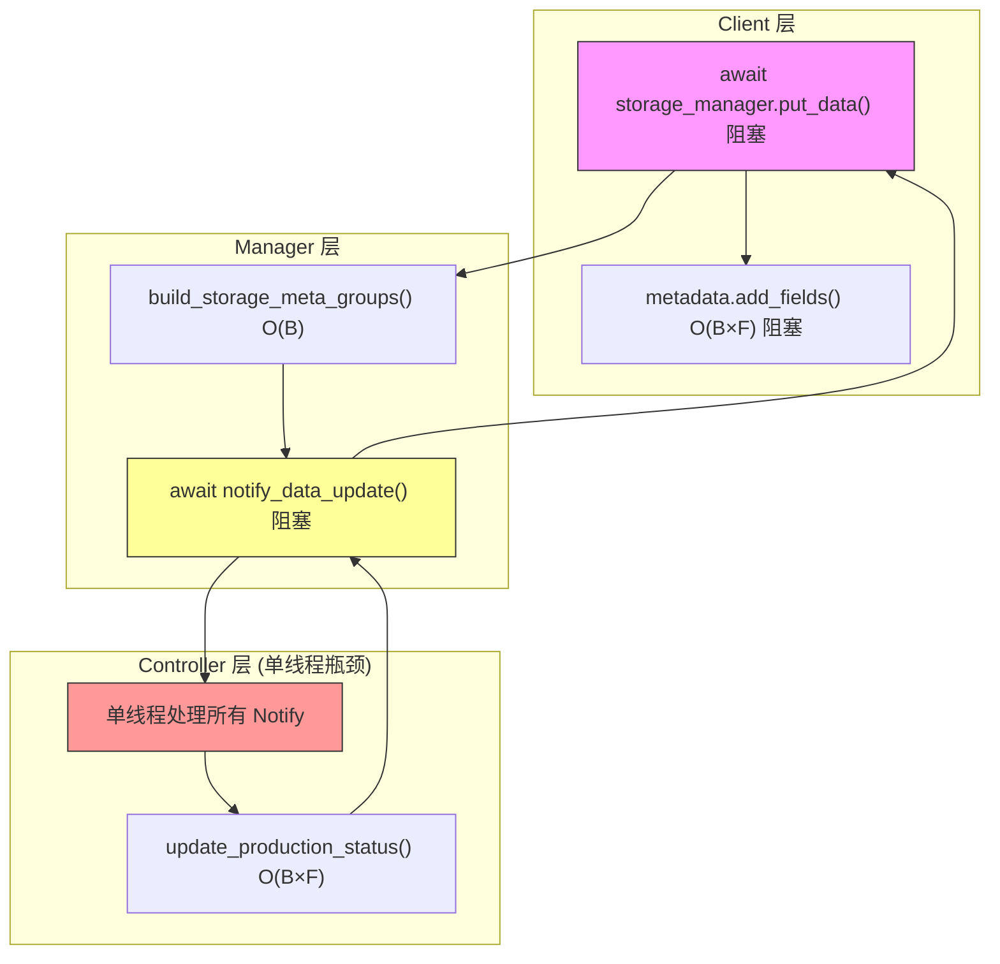
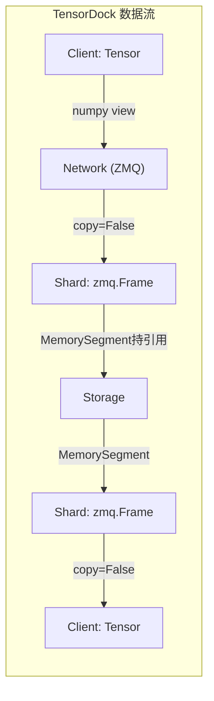

# TensorDock vs TransferQueue 架构与性能深度分析

本文档旨在对比现有的 **TransferQueue** (TQ) 架构与新一代 **TensorDock** (TD) 架构。基于详细的代码静态分析与实测 Benchmark 数据，揭示 TQ 架构在当前高吞吐场景下的系统性瓶颈，并论证 TensorDock 架构在性能、扩展性和维护性上的压倒性优势。

---

## 1. 核心结论摘要 (Executive Summary)

基于最新的 Benchmark 数据（2026-01-09）与代码流分析，我们得出以下核心结论：

*   **吞吐量代差**：在 Large/Huge 高负载场景下，TensorDock 的写入 (PUT) 性能提升 **50%~70%**，读取 (GET) 性能提升 **200%~250%**。TQ 在 ~10GB/s 遇到吞吐墙，而 TensorDock 轻松突破 17GB/s。
*   **架构性阻塞**：TransferQueue 存在 **5 处核心串行阻塞点**，导致 Client CPU 成为瓶颈，无法充分利用网络带宽。即便经过 `optimized-v0.15` 的序列化优化，架构缺陷依然限制了上限。
*   **复杂度塌陷**：TransferQueue 随 Batch Size (B) 和 Fields (F) 呈 **O(B×F)** 的元数据复杂度；TensorDock 通过直接分片路由将其降维至 **O(1)** 或 **O(Shards)**，实现了真正的线性水平扩展。

---

## 2. 性能基准对比 (Benchmark Analysis)

以下数据对比了 **TransferQueue (Optimized v0.15)** 与 **TensorDock** 在不同负载下的吞吐量表现 (GB/s)。

> **注**：`TransferQueue (Optimized)` 代表已针对序列化进行过优化的 TQ 版本，代表了 TQ 架构的性能天花板。

### 2.1 高负载场景吞吐量对比

| 场景 | 负载大小 (Payload) | 操作 | TransferQueue (v0.15) | TensorDock | **性能提升 (Uplift)** |
| :--- | :--- | :--- | :--- | :--- | :--- |
| **Large** | ~2.9 GB | PUT | 10.67 GB/s | 16.80 GB/s | **+57%** |
| | | GET | 4.64 GB/s | 14.83 GB/s | **+220%** |
| **XLarge** | ~5.8 GB | PUT | 10.21 GB/s | 17.88 GB/s | **+75%** |
| | | GET | 6.73 GB/s | 15.27 GB/s | **+127%** |
| **Huge** | ~9.8 GB | PUT | 9.78 GB/s | 16.75 GB/s | **+71%** |
| | | GET | 4.26 GB/s | 14.83 GB/s | **+248%** |

### 2.2 性能差异分析

1.  **GET 性能的巨大鸿沟**：
    *   TransferQueue 的 GET 性能极低（仅 ~4-6 GB/s），甚至随着数据量增加出现下降趋势（Huge 场景仅 4.26 GB/s）。
    *   这是由于 TQ 在 Client 端进行极其昂贵的 `torch.stack` 和全量反序列化，以及 Manager 端的 Merge Sort 逻辑导致的 CPU 密集型瓶颈。
    *   TensorDock 保持了 ~15 GB/s 的高位线，证明其零拷贝链路成功解除了 CPU 瓶颈。

2.  **PUT 性能天花板**：
    *   TransferQueue 在 ~10-11 GB/s 触顶，无法随 Payload 增加继续线性增长。
    *   TensorDock 随 Payload 增加仍有上升空间，最高达 ~18 GB/s，更加接近硬件极限。

---

## 3. TransferQueue 架构瓶颈深度剖析

TransferQueue 的性能天花板源自其架构设计中的**多层级串行阻塞**与**高复杂度元数据操作**。即便优化了底层的序列化代码，架构层面的 O(B×F) 循环依然无法消除。

### 3.1 端到端复杂度对比 (S=StorageUnit数量)

| 阶段 | TransferQueue (TQ) | TensorDock (TD) | 差异本质 |
| :--- | :--- | :--- | :--- |
| **分组计算** | `build_storage_meta_groups()` **O(B)** | `gid_to_shard` 查表 **O(1)** | TD 实现了 O(1) 路由 |
| **数据过滤** | `_filter_storage_data()` **O(B×F)** | 直接切片 **O(1)** | TQ 存在大量 Python 循环 |
| **状态通知** | `notify_data_update()` **串行阻塞** | `update_data_status()` **异步** | TQ 强一致性导致阻塞 |
| **元数据更新** | `add_fields()` **O(B×F)** | 无 | TD 无 Client 端元数据 |
| **GET 结果合并** | 三层循环 + 排序 **O(B×F)** | 顺序拼接 **O(N)** | TQ 重组开销极大 |

> **关键警告**: TQ 的 `O(B×F)` 开销在一次 PUT/GET 请求中会出现 **4-5 次**（过滤、收集、通知、更新等），且大部分是在 Python 主线程中串行执行的。

### 3.2 全链路阻塞点详解

TQ 的架构决定了其请求链路中存在无法绕过的“停车检查点”：

1.  **Controller 单线程瓶颈**：所有 `notify_data_update` 请求必须由 Controller 的单一线程处理。随着节点增多，Controller 必然拥堵。
2.  **Manager 同步等待**：Manager 发送更新后，必须 `poll` 等待 Controller 的 ACK，这段时间完全阻塞，无法处理其他请求。
3.  **Client 元数据风暴**：PUT 完成后，Client 必须同步执行 `add_fields`，遍历所有样本的所有字段更新元数据，直接阻塞主线程。

---

## 4. TensorDock 架构优势分析

TensorDock 通过**去中心化设计**和**零拷贝流水线**，彻底解决了上述问题。

### 4.1 架构设计：直连与去中心化

*   **直连模式 (Direct Connection)**：Client 获取路由表后，直接与 Shard (Storage) 通信，不再经过 Manager 转发数据。减少了一次网络跳跃和中间层的内存拷贝。
*   **Manager 仅做路由**：Manager 不触碰数据，仅负责元数据和路由信息的协调。单点故障不再影响数据平面的传输。
*   **异步设计**：所有状态更新（如 `update_data_status`）均为 Fire-and-Forget 或异步 Future 模式，关键的数据传输路径从不等待控制信令。

### 4.2 内存模型：零拷贝 (Zero-Copy)

TensorDock 实现了从 Client 到 Storage 再到 Client 的全链路零拷贝：

*   **引用计数管理**：使用 `MemorySegment` 直接持有底层 `zmq.Frame`，避免了 Python 对象的反复创建和销毁。
*   **Prompt 共享**：对于重复的 Prompt 数据，TensorDock 仅存储一份物理数据，通过索引共享引用，极大降低了内存带宽压力。

---

## 5. 结论与演进方向

通过对比 **TransferQueue (Optimized v0.15)** 和 **TensorDock**，结论非常明确：

1.  **TransferQueue 架构已触顶**：即使是经过深度优化的 TQ 版本，在处理 Huge 负载时依然受限于 O(B×F) 的架构复杂度，GET 性能更是被严重拖累。其中心化的 Controller 和复杂的元数据同步机制，使其无法适应更大规模的集群扩展。
2.  **TensorDock 是必然选择**：TensorDock 展现了接近线性的性能扩展能力。其“轻元数据、重数据流”、“去中心化直连”的设计理念，完美契合了高性能分布式存储的需求。
3.  **演进方向**：
    *   **全面废弃 TQ 遗留链路**：停止对 TransferQueue 架构的修补性优化。
    *   **架构迁移**：将核心业务流完全迁移至 TensorDock 架构，利用其高吞吐特性释放 GPU 算力。
    *   **生态对齐**：推动上游 Client 和下游 Trainer 适配 TensorDock 的简洁接口（Micro-batch 直连）。

*(注：本文档仅作架构分析与事实陈述，不包含具体代码实施计划。)*
