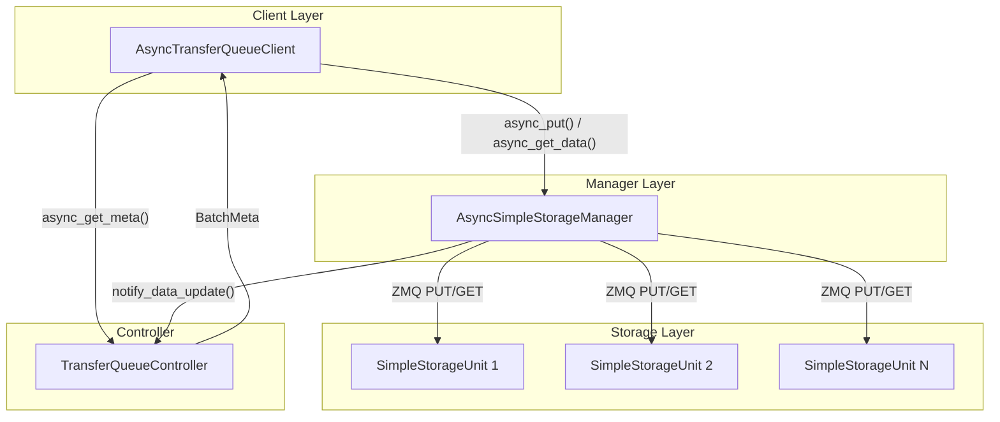
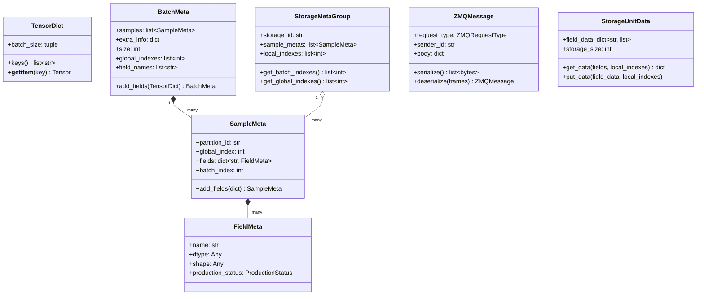
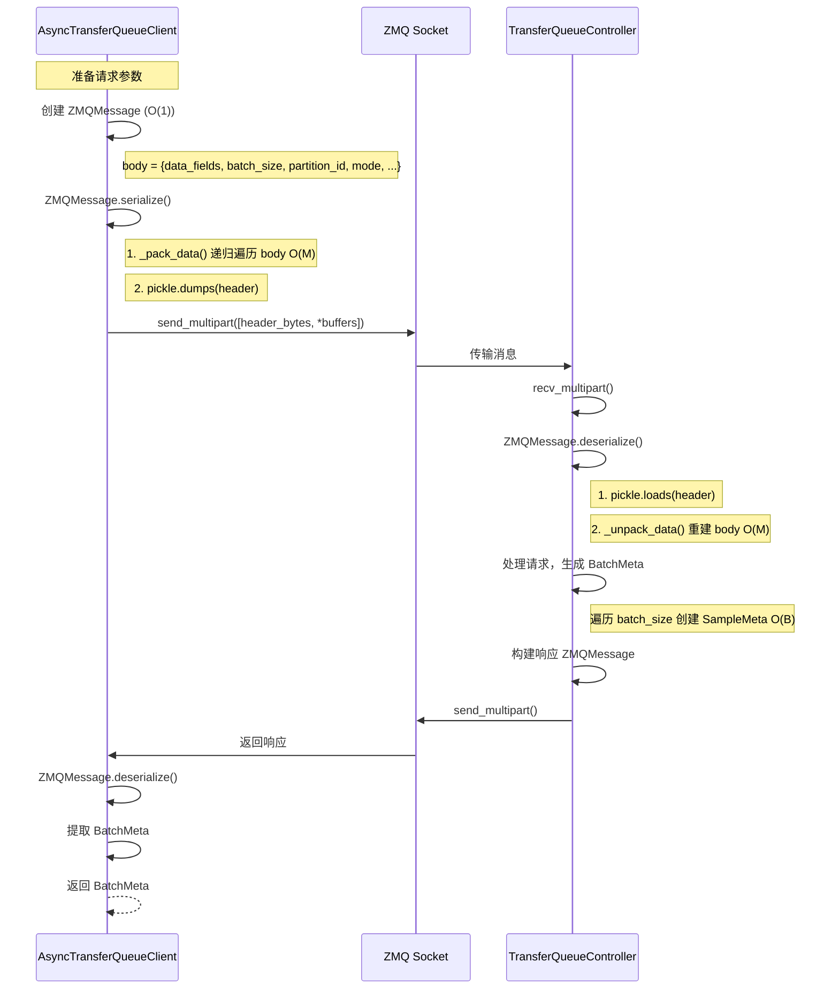
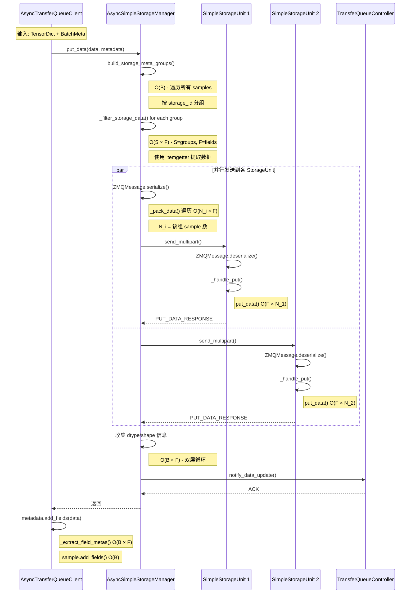
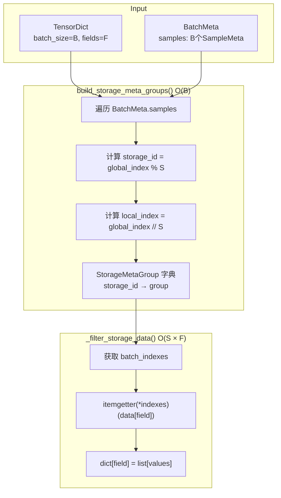
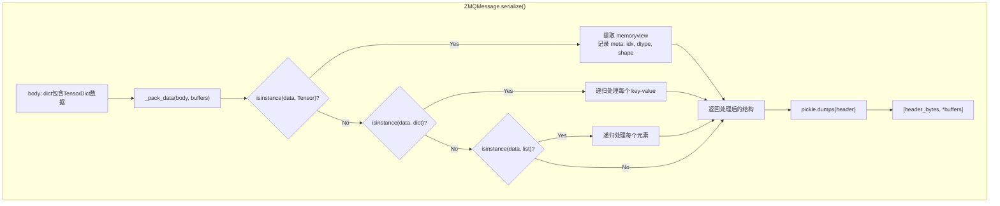
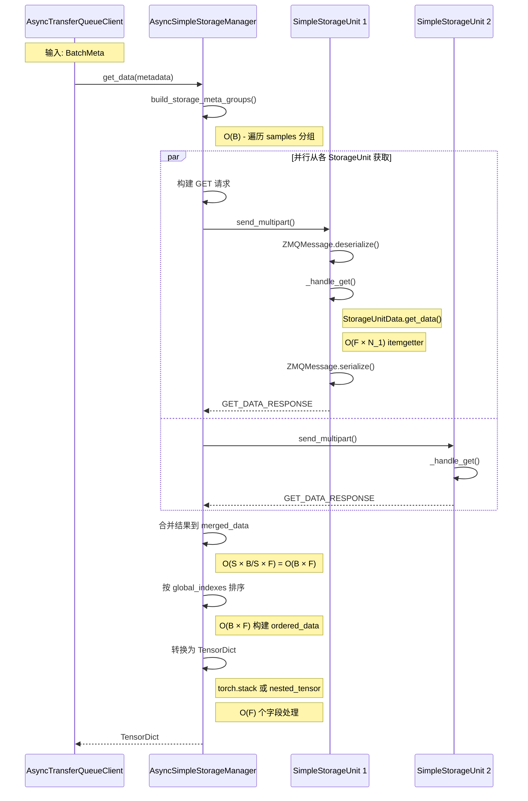
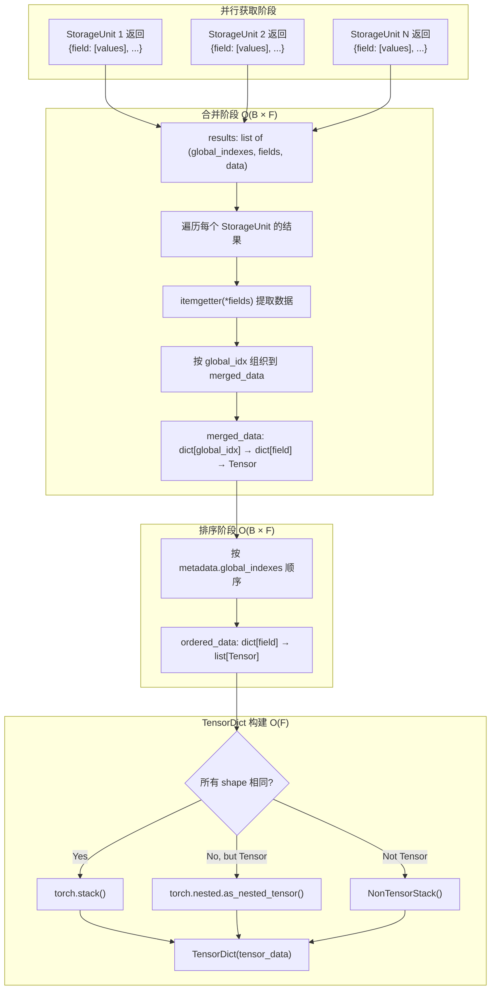
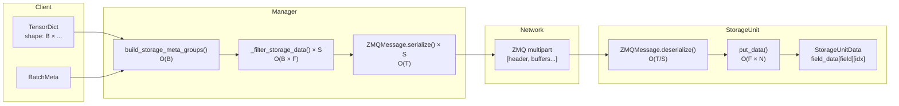
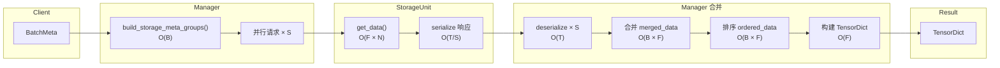

# TransferQueue 数据流分析

本文档分析 TransferQueue (TQ) 在一次完整的 `put`/`get` 过程（包含 `async_put`、`async_get_meta`、`async_get_data` 三个接口）中的数据传递、整理、打包和循环操作。

## 1. 系统架构概览



## 2. 核心数据结构

### 2.1 类图



---

## 3. async_get_meta 流程分析

### 3.1 时序图



### 3.2 数据转换操作统计

| 操作阶段 | 操作类型 | 复杂度 | 说明 |
|---------|---------|--------|------|
| 请求构建 | `ZMQMessage.create()` | O(1) | 创建消息对象 |
| 序列化 | `_pack_data()` | O(M) | M = body 中嵌套元素数量，递归遍历 |
| 序列化 | `pickle.dumps()` | O(M) | 序列化 header 字典 |
| 反序列化 | `pickle.loads()` | O(M) | 反序列化 header |
| 反序列化 | `_unpack_data()` | O(M) | 递归重建数据结构 |
| 元数据构建 | `BatchMeta.__post_init__()` | O(B) | B = batch_size，遍历所有 samples |

---

## 4. async_put 流程分析

### 4.1 完整时序图



### 4.2 数据转换详细分析

#### 4.2.1 Manager 层数据整理



#### 4.2.2 ZMQ 序列化过程



### 4.3 操作复杂度统计

| 阶段 | 函数/操作 | 复杂度 | 循环描述 |
|------|----------|--------|---------|
| **Manager 层** | | | |
| 分组 | `build_storage_meta_groups()` | O(B) | 遍历 B 个 samples |
| 数据过滤 | `_filter_storage_data()` | O(S × F × B/S) = O(B × F) | S 个组，每组遍历 F 个 fields |
| 序列化 | `_pack_data()` | O(T) | T = 所有 Tensor 元素总数 |
| dtype/shape 收集 | 双层循环 | O(B × F) | 遍历所有 global_index 和 field |
| **StorageUnit 层** | | | |
| 反序列化 | `_unpack_data()` | O(T/S) | T/S = 该单元的 Tensor 数 |
| 存储 | `StorageUnitData.put_data()` | O(F × N) | F 个 fields，N 个 local_indexes |
| **Client 层** | | | |
| 元数据更新 | `_extract_field_metas()` | O(B × F) | B 个 samples，F 个 fields |
| 元数据更新 | `SampleMeta.add_fields()` | O(F) | 每个 sample 合并 F 个 fields |

> **符号说明**:
> - B = batch_size (样本数)
> - F = fields 数量
> - S = StorageUnit 数量
> - T = Tensor 总元素数
> - N = 每个 StorageUnit 的 local_indexes 数 ≈ B/S

---

## 5. async_get_data 流程分析

### 5.1 完整时序图



### 5.2 数据合并流程



### 5.3 操作复杂度统计

| 阶段 | 函数/操作 | 复杂度 | 说明 |
|------|----------|--------|------|
| **Manager 层** | | | |
| 分组 | `build_storage_meta_groups()` | O(B) | 同 put |
| 请求构建 | `ZMQMessage.serialize()` | O(1) | 请求体很小 |
| 结果合并 | 三层循环合并 | O(B × F) | |
| 排序 | 构建 ordered_data | O(B × F) | |
| TensorDict | `torch.stack` / `nested_tensor` | O(F × B) | 每个 field 处理 B 个 tensor |
| **StorageUnit 层** | | | |
| 数据获取 | `StorageUnitData.get_data()` | O(F × N) | N = local_indexes 数 |
| 序列化返回 | `_pack_data()` | O(T/S) | 该单元的数据量 |

---

## 6. 完整数据流概览

### 6.1 Put 操作数据变换流程



### 6.2 Get 操作数据变换流程



---

## 7. 性能热点分析

### 7.1 主要循环操作汇总

| 操作 | 出现位置 | 循环次数 | 每次操作代价 |
|------|---------|----------|-------------|
| `build_storage_meta_groups()` | Manager put/get | O(B) | O(1) 哈希查找 |
| `_filter_storage_data()` | Manager put | O(S) 调用 × O(F × B/S) | itemgetter 索引 |
| `_pack_data()` | ZMQ serialize | O(T) 递归深度 | memoryview 创建 |
| `_unpack_data()` | ZMQ deserialize | O(T) 递归深度 | torch.frombuffer |
| `StorageUnitData.put_data()` | StorageUnit | O(F × N) | 列表赋值 |
| `StorageUnitData.get_data()` | StorageUnit | O(F × N) | itemgetter |
| 结果合并 | Manager get | O(B × F) | dict 更新 |
| `_extract_field_metas()` | Client add_fields | O(B × F) | FieldMeta 创建 |

### 7.2 时间复杂度总结

| 操作 | 总复杂度 | 主要瓶颈 |
|------|---------|----------|
| `async_get_meta()` | O(B) | Controller 元数据生成 |
| `async_put()` | O(B × F + T) | 序列化 + 存储写入 |
| `async_get_data()` | O(B × F + T) | 反序列化 + 结果合并 |

> **注**: T ∝ B × F × avg_tensor_size，因此实际复杂度取决于数据规模

### 7.3 内存拷贝分析

| 阶段 | 操作 | 是否零拷贝 | 说明 |
|------|------|-----------|------|
| `_pack_data()` | Tensor → memoryview | ✅ 是 | 直接获取 numpy buffer 视图 |
| ZMQ send | memoryview → 网络 | ✅ 是 | copy=False |
| `_unpack_data()` | buffer → Tensor | ✅ 是 | torch.frombuffer |
| `torch.stack()` | list → Tensor | ❌ 否 | 需要分配新内存 |
| `nested_tensor` | list → NestedTensor | ❌ 否 | 需要分配新内存 |

---

## 8. 优化建议

### 8.1 减少循环次数

1. **批量处理 FieldMeta**: `_extract_field_metas()` 中对每个 sample 单独迭代，可考虑向量化
2. **预分配 StorageMetaGroup**: 避免动态创建字典

### 8.2 减少数据拷贝

1. **延迟 TensorDict 构建**: 在某些场景下可直接返回原始 buffer
2. **复用 buffer**: 多次 put/get 时复用已分配的内存

### 8.3 并行化改进

1. **Manager 层并行序列化**: 当前 `_filter_storage_data()` 是顺序执行
2. **StorageUnit 层使用线程池**: 处理多个并发请求

---

## 9. 关键函数调用链

### 9.1 async_put 调用链

```
async_put()
├── async_get_meta() [如果 metadata 为 None]
├── storage_manager.put_data()
│   ├── build_storage_meta_groups()           # O(B)
│   ├── for storage_id, meta_group:           # O(S) 并行
│   │   ├── _filter_storage_data()            # O(F × B/S)
│   │   └── _put_to_single_storage_unit()
│   │       ├── ZMQMessage.create()
│   │       ├── ZMQMessage.serialize()        # O(T/S)
│   │       │   ├── _pack_data()
│   │       │   └── pickle.dumps()
│   │       └── socket.send_multipart()
│   ├── 收集 dtype/shape                      # O(B × F)
│   └── notify_data_update()
└── metadata.add_fields()                     # O(B × F)
    ├── _extract_field_metas()
    └── sample.add_fields() for each sample
```

### 9.2 async_get_data 调用链

```
async_get_data()
└── storage_manager.get_data()
    ├── build_storage_meta_groups()           # O(B)
    ├── for storage_id, meta_group:           # O(S) 并行
    │   └── _get_from_single_storage_unit()
    │       ├── ZMQMessage.serialize()
    │       └── socket.recv_multipart()
    │           └── ZMQMessage.deserialize()  # O(T/S)
    │               ├── pickle.loads()
    │               └── _unpack_data()
    ├── 合并结果循环                           # O(B × F)
    │   └── merged_data[global_idx][field] = tensor
    ├── 排序循环                               # O(B × F)
    │   └── ordered_data[field].append(...)
    └── 构建 TensorDict                        # O(F)
        └── torch.stack() 或 nested_tensor()
```

---

## 10. 附录：数据结构示例

### 10.1 put 操作数据流示例

假设 `batch_size=4`, `fields=["input_ids", "attention_mask"]`, `storage_units=2`:

```python
# 输入
data = TensorDict({
    "input_ids": torch.tensor([[1,2,3], [4,5,6], [7,8,9], [10,11,12]]),      # shape: (4, 3)
    "attention_mask": torch.tensor([[1,1,1], [1,1,0], [1,0,0], [1,1,1]])     # shape: (4, 3)
}, batch_size=4)

metadata.global_indexes = [0, 1, 2, 3]

# build_storage_meta_groups() 分组结果
# storage_unit_0 (global_idx % 2 == 0): global_indexes=[0, 2], local_indexes=[0, 1]
# storage_unit_1 (global_idx % 2 == 1): global_indexes=[1, 3], local_indexes=[0, 1]

# _filter_storage_data() 结果
# 对于 storage_unit_0:
storage_data_0 = {
    "input_ids": [tensor([1,2,3]), tensor([7,8,9])],
    "attention_mask": [tensor([1,1,1]), tensor([1,0,0])]
}

# 对于 storage_unit_1:
storage_data_1 = {
    "input_ids": [tensor([4,5,6]), tensor([10,11,12])],
    "attention_mask": [tensor([1,1,0]), tensor([1,1,1])]
}

# StorageUnitData 存储结构
# storage_unit_0.field_data:
{
    "input_ids": [tensor([1,2,3]), tensor([7,8,9]), None, ...],
    "attention_mask": [tensor([1,1,1]), tensor([1,0,0]), None, ...]
}
```

### 10.2 ZMQMessage 序列化结构

```python
# serialize() 输出
frames = [
    # Frame 0: Header (pickle bytes)
    pickle.dumps({
        "request_type": ZMQRequestType.PUT_DATA,
        "sender_id": "manager_xxx",
        "receiver_id": "storage_unit_0",
        "request_id": "abc123",
        "timestamp": 1704067200.0,
        "body_structure": {
            "local_indexes": [0, 1],
            "data": {
                "input_ids": [
                    {"__tq_meta__": "tensor", "idx": 0, "dtype": torch.int64, "shape": (3,)},
                    {"__tq_meta__": "tensor", "idx": 1, "dtype": torch.int64, "shape": (3,)}
                ],
                "attention_mask": [
                    {"__tq_meta__": "tensor", "idx": 2, "dtype": torch.int64, "shape": (3,)},
                    {"__tq_meta__": "tensor", "idx": 3, "dtype": torch.int64, "shape": (3,)}
                ]
            }
        }
    }),
    # Frame 1-N: Raw tensor buffers (memoryview)
    memoryview(tensor([1,2,3]).numpy()),   # idx=0
    memoryview(tensor([7,8,9]).numpy()),   # idx=1
    memoryview(tensor([1,1,1]).numpy()),   # idx=2
    memoryview(tensor([1,0,0]).numpy()),   # idx=3
]
```

---

*文档生成时间: 2026-01-12*
