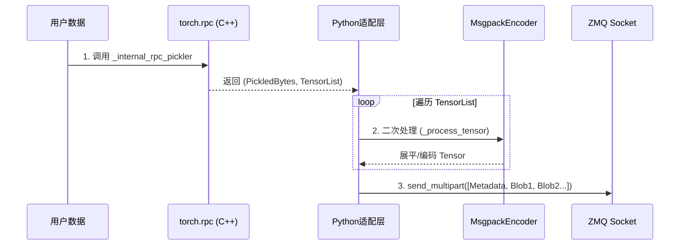
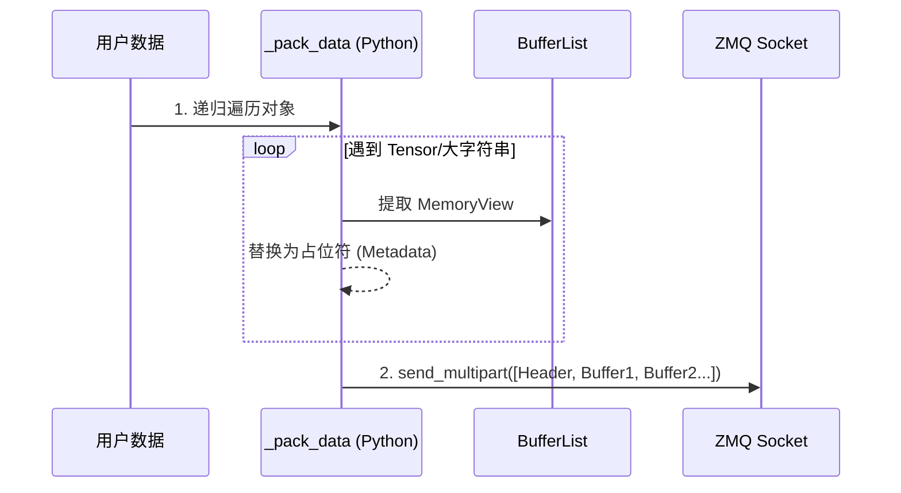

# Zero-Copy 序列化优化方案深度对比报告

本文档旨在从代码架构、稳定性和性能机制三个维度，深度对比 TransferQueue 项目中现有的两种零拷贝序列化实现方案：`master` 分支（基于 PyTorch RPC）与 `feature/optimize-serialization-v0.15` 分支（基于自定义递归打包）。

## 1. 方案概览

### 方案 A: `master` 分支 (PyTorch Internal RPC)
该方案利用 PyTorch 分布式框架内部的私有 API `_internal_rpc_pickler` 来剥离 Tensor 数据。

*   **核心机制**: 依赖 `torch.distributed.rpc.internal` 进行对象解构。
*   **流程**:
    1.  C++ 层提取 Tensor。
    2.  Python 层再次遍历提取出的 Tensor 列表进行二次处理（如嵌套 Tensor 展平）。
    3.  使用 Msgpack 对部分数据进行编码。
*   **依赖**: 强依赖 PyTorch Distributed 子系统。

### 方案 B: `feature/optimize-serialization-v0.15` (自定义递归打包)
该方案实现了一套纯 Python 的递归遍历算法 `_pack_data`，用于精准提取 Tensor 和大字符串。

*   **核心机制**: 自定义协议，递归遍历 List/Dict/Tuple，将大数据块替换为占位符。
*   **流程**:
    1.  单次遍历对象树。
    2.  原地替换 Tensor/String 为元数据描述符。
    3.  直接收集 Buffer 到列表中。
*   **依赖**: 仅依赖标准 `pickle` 和 `torch` 基础库。

---

## 2. 架构流程对比

以下时序图展示了两种方案在数据序列化阶段的处理流程差异。

### 方案 A 流程图 (master)

**分析**: 存在明显的“双重遍历”开销。C++ 层做了一次剥离，Python 层为了适配 ZMQ 格式又做了一次复杂的后处理，路径冗长。

### 方案 B 流程图 (optimized v0.15)

**分析**: 单次遍历，路径极简。数据在遍历过程中直接“落袋为安”，没有中间状态的转换开销。

---

## 3. 深度代码分析

### 3.1 稳定性与风险 (Stability)

| 维度 | 方案 A (`master`) | 方案 B (`optimized`) | 评价 |
| :--- | :--- | :--- | :--- |
| **API 来源** | `torch.distributed.rpc.internal` | `torch` 公共 API + Python 原生 | **方案 B 胜出** |
| **风险点** | 依赖 PyTorch **私有** API，PyTorch 升级可能导致崩溃。 | 逻辑完全自控，不依赖黑盒实现。 | **方案 B 胜出** |
| **环境要求** | 需要完整 PyTorch Distributed 环境支持。 | 仅需 PyTorch 基础环境。 | **方案 B 胜出** |

> **关键代码对比**:
> *   **A**: `from torch.distributed.rpc.internal import _internal_rpc_pickler` (引用私有库，高风险)
> *   **B**: `def _pack_data(data, buffers):` (自实现逻辑，零风险)

### 3.2 性能机制 (Performance Mechanism)

| 维度 | 方案 A (`master`) | 方案 B (`optimized`) | 评价 |
| :--- | :--- | :--- | :--- |
| **遍历次数** | **2次+** (C++序列化一次 + Python后处理一次)。 | **1次** (仅在打包时递归遍历一次)。 | **方案 B 胜出** |
| **字符串处理** | **拷贝** (普通 Pickle 处理)，NLP 场景是瓶颈。 | **零拷贝** (>=10KB 自动走 MemoryView)。 | **方案 B 胜出** |
| **CPU 开销** | 高 (多重函数调用堆栈)。 | 低 (直接生成最终 Buffer 列表)。 | **方案 B 胜出** |

### 3.3 扩展性 (Extensibility)

*   **方案 A**: 受限于 PyTorch RPC 能够识别的类型。如果需要支持新的自定义大对象（如 Numpy 数组或自定义 C++ 对象），很难切入 `_internal_rpc_pickler` 的逻辑。
*   **方案 B**: 代码极其灵活。只需在 `_pack_data` 函数中增加一个 `elif isinstance(data, MyType):` 分支，即可轻松支持任意类型的零拷贝传输。

---

## 4. 结论与建议

从代码分析的角度来看，**方案 B (`feature/optimize-serialization-v0.15`) 是全方位的升级版本**。

1.  **更安全**: 移除了对不稳定内部 API 的依赖。
2.  **更高效**: 算法复杂度更低，CPU 占用更少。
3.  **更全面**: 补齐了 NLP 场景下大字符串无法零拷贝的短板。

**建议**: 强烈建议将 `feature/optimize-serialization-v0.15` 中的序列化协议合并入主分支，完全替代现有的基于 internal rpc 的实现。
